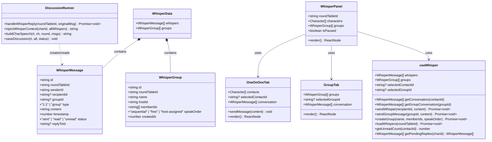
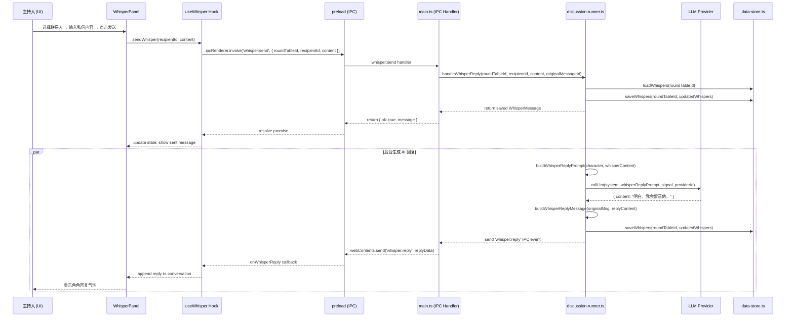
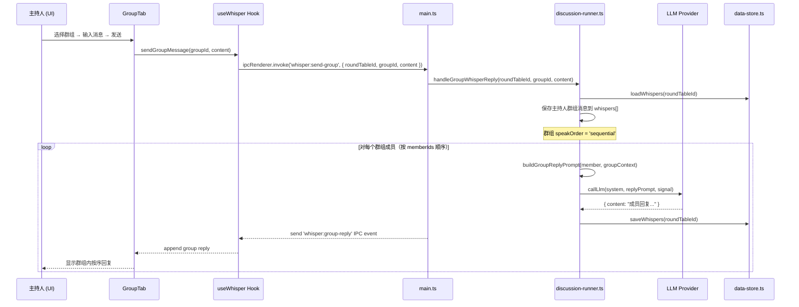
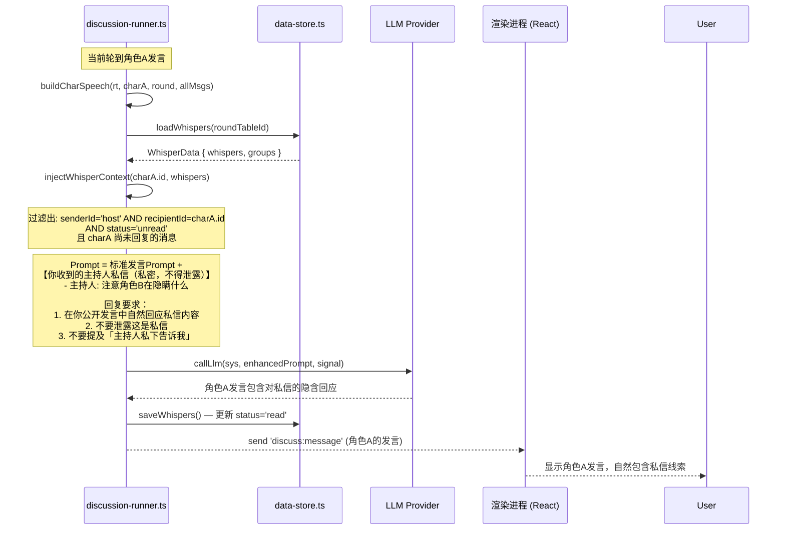
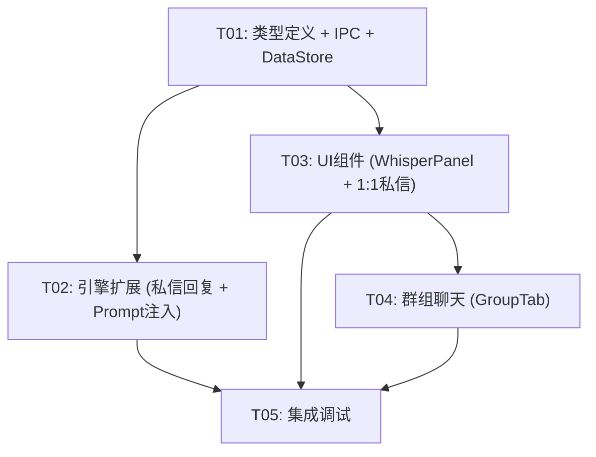

# ARCH: 主持人私密消息系统（Whisper System）

> **版本**: v0.1  
> **作者**: Bob（Architect）  
> **基于 PRD**: `PRD-whisper-system.md`  
> **日期**: 2025-07-18

---

## 1. 实现方案 + 框架选型

### 1.1 核心设计原则

| 原则 | 说明 |
|------|------|
| **零新增依赖** | 使用现有 Electron IPC 体系、React/MUI/Tailwind 栈，不引入新包 |
| **扩展不重写** | 在现有讨论引擎（discussion-runner.ts）基础上扩展，不修改现有 Message 类型 |
| **数据隔离** | 私信数据独立文件存储 `_whispers.json`，与主讨论 `_messages.json` 互不影响 |
| **可见性硬约束** | 私信内容在 UI 层和 Prompt 层都受严格可见性规则控制 |

### 1.2 技术挑战与方案

| 挑战 | 方案 |
|------|------|
| 1:1 私信发送 → 角色自动 AI 回复 | 在 discussion-runner 的暂停恢复流程中，新增 `whisper:send` IPC → 主进程接收 → 调用 LLM 生成回复 → `whisper:reply` 推送回渲染进程 |
| 角色发言时私信注入 Prompt | 在 `buildCharSpeech` 和 `buildCharSpeechPrompt` 中，根据角色 ID 查询未回复私信，追加「你收到的主持人私信」段落 |
| 私信不写入公开记忆 | 记忆更新 Prompt 中不包含私信；私信对推理链路完全透明 |
| 暂停态 UI 切换 | 右侧面板增加 tab 切换：「讨论信息」/「私密消息」；暂停时自动切换到私信 Tab 并启用输入；继续/完成时禁用输入 |

### 1.3 架构模式

```
┌────────────────────────────────────────────────────────────────┐
│                        渲染进程 (React)                         │
│  ┌─────────────────────────────────────────────────────────┐   │
│  │ Discussion.tsx                               │           │   │
│  │  ├── 左侧角色列表                              │           │   │
│  │  ├── 中央讨论流 (MessageBubble)               │           │   │
│  │  └── 右侧面板                                  │           │   │
│  │       ├── Tab: [讨论信息]  [私密消息] ★NEW★     │           │   │
│  │       │    └── WhisperPanel (新增组件)          │           │   │
│  │       │         ├── OneOnOneTab (联系人+聊天)   │           │   │
│  │       │         ├── GroupTab (群组列表+聊天)    │           │   │
│  │       │         └── CreateGroupDialog          │           │   │
│  │       └── ...                                 │           │   │
│  └─────────────────────────────────────────────────────────┘   │
│                          │ IPC (contextBridge)                  │
├────────────────────────────────────────────────────────────────┤
│                        主进程 (Electron)                        │
│  ┌─────────────────────────────────────────────────────────┐   │
│  │ main.ts (IPC handler 注册)                               │   │
│  │  ├── whisper:send        (renderer → main)              │   │
│  │  ├── whisper:send-group  (renderer → main)  (P1)        │   │
│  │  ├── whisper:create-group (renderer → main) (P1)        │   │
│  │  ├── whisper:load        (renderer → main)              │   │
│  │  ├── whisper:reply       (main → renderer)              │   │
│  │  └── whisper:group-reply (main → renderer) (P1)         │   │
│  │                                                          │   │
│  │ discussion-runner.ts (扩展)                               │   │
│  │  ├── handleWhisperReply()   ★NEW★ — 处理私信 AI 回复      │   │
│  │  ├── injectWhisperContext() ★NEW★ — 构建私信上下文段      │   │
│  │  └── buildCharSpeech() 修改 — 注入私信上下文              │   │
│  │                                                          │   │
│  │ data-store.ts (扩展)                                      │   │
│  │  ├── saveWhispers()        ★NEW★                        │   │
│  │  ├── loadWhispers()        ★NEW★                        │   │
│  │  └── deleteWhispers()      ★NEW★                        │   │
│  └─────────────────────────────────────────────────────────┘   │
│                          │ 文件系统                              │
│  ┌─────────────────────────────────────────────────────────┐   │
│  │ data/                                                    │   │
│  │  ├── _index.json                                         │   │
│  │  ├── {topic}-{date}.json       (RoundTable 元数据)       │   │
│  │  ├── {topic}-{date}_messages.json  (主讨论消息)          │   │
│  │  └── {topic}-{date}_whispers.json  ★NEW★ (私信数据)     │   │
│  └─────────────────────────────────────────────────────────┘   │
└────────────────────────────────────────────────────────────────┘
```

---

## 2. 新增/修改文件列表

### 2.1 新增文件

| 文件路径 | 说明 |
|----------|------|
| `src/components/WhisperPanel.tsx` | 私密消息面板容器组件（Tab 切换：1:1 私信 / 群组聊天） |
| `src/components/OneOnOneTab.tsx` | 1:1 私信 Tab：联系人列表 + 消息记录 + 输入区 |
| `src/components/GroupTab.tsx` | 群组聊天 Tab（P1 骨架，MVP 仅占位） |
| `src/components/CreateGroupDialog.tsx` | 创建群组弹窗（P1 骨架，MVP 仅占位） |
| `src/hooks/useWhisper.ts` | Whisper 系统状态 Hook（发送/接收/加载私信，管理联系人选中态） |

### 2.2 修改文件

| 文件路径 | 改动内容 |
|----------|----------|
| `src/lib/types.ts` | 新增 `WhisperMessage`、`WhisperGroup`、`WhisperData` 接口 + `generateId` 复用 |
| `src/types/electron.d.ts` | 新增 `whisper*` IPC 方法类型声明（send/load/reply 等） |
| `electron/preload.ts` | 新增 `whisper*` contextBridge 通道（send/load/onReply/onGroupReply 等） |
| `electron/main.ts` | 新增 `whisper:*` IPC handler 注册（send/load/create-group/send-group） |
| `electron/discussion-runner.ts` | 新增 `handleWhisperReply()` 私信 AI 回复函数；修改 `buildCharSpeech()` 注入私信上下文；修改 `saveDiscussion()` 同步保存私信 |
| `electron/data-store.ts` | 新增 `saveWhispers()`、`loadWhispers()`、`deleteWhispers()` 函数 |
| `src/pages/Discussion.tsx` | 右侧面板增加 tab 切换 + WhisperPanel 嵌入；暂停态控制私信面板可用性 |
| `src/hooks/useDiscussion.ts` | 新增 `whisper*` 事件监听注册（`onWhisperReply` 等） |
| `src/lib/prompts.ts` | 新增 `buildWhisperContext()` 函数；修改 `buildCharacterSpeechPrompt()` 增加私信上下文字段 |
| `src/components/MessageBubble.tsx` | 新增 `WhisperMessageBubble` 子组件或增加 `isWhisper` prop 支持私信气泡样式 |

---

## 3. 数据结构和接口设计

### 3.1 类型定义（`src/lib/types.ts` 新增）

```typescript
// ===== Whisper 系统类型 =====

/** 私信消息 */
export interface WhisperMessage {
  id: string;
  roundTableId: string;
  senderId: string;           // 'host' 或角色 ID
  /** 1:1 私信时，目标角色 ID */
  recipientId?: string;
  /** 群组消息时，关联群组 ID */
  groupId?: string;
  type: '1:1' | 'group';
  content: string;
  timestamp: number;
  status: 'sent' | 'read' | 'unread';
  /** AI 生成的回复关联的原始消息 ID（用于关联 thread） */
  replyToId?: string;
}

/** 私密群组 */
export interface WhisperGroup {
  id: string;
  roundTableId: string;
  name: string;
  hostId: string;             // 'host' 或角色 ID（主持人默认群主）
  memberIds: string[];        // 角色 ID 数组
  speakOrder: 'sequential' | 'free' | 'host-assigned';
  createdAt: number;
}

/** 私信存储文件结构 */
export interface WhisperData {
  whispers: WhisperMessage[];
  groups: WhisperGroup[];
}
```

### 3.2 IPC 通道设计

#### IPC invoke（renderer → main）

| 通道 | Payload | 返回 | 说明 |
|------|---------|------|------|
| `whisper:send` | `{ roundTableId: string, recipientId: string, content: string }` | `{ ok: boolean, message?: WhisperMessage }` | 主持人发送 1:1 私信 |
| `whisper:load` | `{ roundTableId: string }` | `WhisperData` | 加载私信数据 |
| `whisper:create-group` | `{ roundTableId: string, name: string, memberIds: string[], speakOrder }` | `{ ok: boolean, group?: WhisperGroup }` | 创建群组（P1） |
| `whisper:send-group` | `{ roundTableId: string, groupId: string, content: string }` | `{ ok: boolean, message?: WhisperMessage }` | 发送群组消息（P1） |

#### IPC send（main → renderer）

| 通道 | Payload | 说明 |
|------|---------|------|
| `whisper:reply` | `{ roundTableId: string, originalMessageId: string, reply: WhisperMessage }` | 角色 AI 回复私信推送 |
| `whisper:group-reply` | `{ roundTableId: string, groupId: string, reply: WhisperMessage }` | 群组 AI 回复推送（P1） |

### 3.3 Class Diagram



### 3.4 存储文件结构

```
data/
├── _index.json                       # { roundTableId → filename }
├── my-discussion-2025-07-18.json     # RoundTable 元数据
├── my-discussion-2025-07-18_messages.json  # 主讨论消息 (Message[])
└── my-discussion-2025-07-18_whispers.json  # ★NEW★ 私信数据
    {
      "whispers": [
        {
          "id": "uuid",
          "roundTableId": "uuid",
          "senderId": "host",
          "recipientId": "char-uuid",
          "type": "1:1",
          "content": "注意角色B在隐瞒什么",
          "timestamp": 1721312345678,
          "status": "unread"
        },
        {
          "id": "uuid",
          "roundTableId": "uuid",
          "senderId": "char-uuid",
          "type": "1:1",
          "recipientId": "host",
          "content": "明白，我会留意他。",
          "timestamp": 1721312350000,
          "status": "unread",
          "replyToId": "prev-msg-uuid"
        }
      ],
      "groups": [
        {
          "id": "uuid",
          "roundTableId": "uuid",
          "name": "暗中联盟",
          "hostId": "host",
          "memberIds": ["char-a-id", "char-b-id"],
          "speakOrder": "sequential",
          "createdAt": 1721312300000
        }
      ]
    }
```

---

## 4. 程序调用流程（时序图）

### 4.1 时序图 1：主持人发送 1:1 私信 → 角色自动回复



### 4.2 时序图 2：私密群组消息发送 → 群内角色按序回复（P1）



### 4.3 时序图 3：角色发言时 Prompt 注入私信上下文



---

## 5. 任务列表（有序）

### 5.1 任务分解

| ID | 任务名称 | 涉及文件 | 依赖 | 优先级 |
|----|---------|---------|------|-------|
| T01 | **项目基础设施** — 类型定义 + IPC 通道 + DataStore 扩展 | `src/lib/types.ts`, `src/types/electron.d.ts`, `electron/preload.ts`, `electron/main.ts`, `electron/data-store.ts` | 无 | P0 |
| T02 | **后端核心逻辑** — 讨论引擎扩展（私信回复 + Prompt 注入） | `electron/discussion-runner.ts`, `src/lib/prompts.ts` | T01 | P0 |
| T03 | **UI 组件** — WhisperPanel + OneOnOneTab（暂停态 1:1 私信面板） | `src/components/WhisperPanel.tsx`, `src/components/OneOnOneTab.tsx`, `src/components/MessageBubble.tsx`, `src/pages/Discussion.tsx`, `src/hooks/useWhisper.ts`, `src/hooks/useDiscussion.ts` | T01 | P0 |
| T04 | **群组聊天** — GroupTab + CreateGroupDialog（P1 功能，MVP 建骨架占位） | `src/components/GroupTab.tsx`, `src/components/CreateGroupDialog.tsx` | T03 | P1 |
| T05 | **集成调试** — 串联所有组件 + 端到端测试 | 全链路 | T02, T03, T04 | P0 |

### 5.2 任务依赖图



---

## 6. 每个任务的详细说明

### T01 — 类型定义 + IPC 通道 + DataStore 扩展

**目标**：建立 Whisper 系统的基础设施层，所有数据结构和通信通道就绪。

**具体改动**：

1. **`src/lib/types.ts`** — 新增：
   - `WhisperMessage` 接口
   - `WhisperGroup` 接口
   - `WhisperData` 接口

2. **`src/types/electron.d.ts`** — 在 `ElectronAPI` 接口中新增：
   - `whisperSend(payload)` → `Promise<{ok, message?}>`
   - `whisperLoad(payload)` → `Promise<WhisperData>`
   - `whisperCreateGroup(payload)` → `Promise<{ok, group?}>`
   - `whisperSendGroup(payload)` → `Promise<{ok, message?}>`
   - `onWhisperReply(callback)` → `() => void`
   - `onWhisperGroupReply(callback)` → `() => void`

3. **`electron/preload.ts`** — 在 `contextBridge` 中注册：
   - `whisperSend` → `ipcRenderer.invoke('whisper:send', ...)`
   - `whisperLoad` → `ipcRenderer.invoke('whisper:load', ...)`
   - `whisperCreateGroup` → `ipcRenderer.invoke('whisper:create-group', ...)`
   - `whisperSendGroup` → `ipcRenderer.invoke('whisper:send-group', ...)`
   - `onWhisperReply` → `ipcRenderer.on('whisper:reply', ...)`
   - `onWhisperGroupReply` → `ipcRenderer.on('whisper:group-reply', ...)`

4. **`electron/main.ts`** — 新增 IPC handler：
   - `ipcMain.handle('whisper:send', ...)` — 验证参数 → 保存私信 → 返回
   - `ipcMain.handle('whisper:load', ...)` — 读取 `{filename}_whispers.json`
   - `ipcMain.handle('whisper:create-group', ...)` — 创建群组并持久化（P1）
   - `ipcMain.handle('whisper:send-group', ...)` — 群组消息发送（P1）

5. **`electron/data-store.ts`** — 新增：
   - `saveWhispers(dataDir, filename, data: WhisperData): void`
   - `loadWhispers(dataDir, filename): WhisperData`
   - `deleteWhispers(dataDir, filename): void`
   - 使用 `atomicWriteJson` 确保写入原子性

---

### T02 — 讨论引擎扩展（私信回复 + Prompt 注入）

**目标**：主持人发送私信后角色能自动 AI 回复，且角色发言 Prompt 中包含未回复私信上下文。

**具体改动**：

1. **`electron/discussion-runner.ts`** 新增函数：

   ```typescript
   /**
    * 处理 1:1 私信 AI 回复
    * 1. 保存主持人发送的私信到 _whispers.json
    * 2. 构建角色私信回复 Prompt
    * 3. 调用 LLM 生成回复
    * 4. 保存角色回复到 _whispers.json
    * 5. 通过 IPC 推送 whisper:reply 到渲染进程
    */
   export async function handleWhisperReply(
     roundTableId: string,
     recipientId: string,
     whisperContent: string,
     originalMessageId: string
   ): Promise<WhisperMessage | null>
   ```

   ```typescript
   /**
    * 构建角色私信回复 Prompt
    * 格式：以角色身份回复主持人私信，语气自然
    */
   function buildWhisperReplyPrompt(
     character: InlineCharacter,
     whisperContent: string
   ): string
   ```

   ```typescript
   /**
    * 注入私信上下文到角色发言 Prompt
    * 过滤出：主持人发送给该角色的未回复私信 (status='unread')
    * 返回格式化的私信上下文字符串以及本次需要被标记为已读的消息 id 列表。
    * 调用方负责持久化状态更新，避免重复注入。
    */
   function injectWhisperContext(
     characterId: string,
     allWhispers: WhisperMessage[]
   ): { text: string; readIds: string[] }
   ```

2. **`electron/discussion-runner.ts`** 修改函数：

   - **`buildCharSpeech()`** — 在调用 `injectWhisperContext()` 后，由调用方根据返回的 `readIds` 标记私信为已读并 `saveWhispers()`；`buildCharSpeech` 内部保持无副作用。
   - **`saveDiscussion()`** — 额外调用 `saveWhispers()` 保存私信数据

3. **`src/lib/prompts.ts`** 新增导出函数（供 retry 等前端逻辑使用）：

   ```typescript
   /**
    * 构建私信上下文段（供前端 buildCharacterSpeechPrompt 引用）
    */
   export function buildWhisperContext(
     character: Character,
     whispers: WhisperMessage[]
   ): string
   ```

   修改 `buildCharacterSpeechPrompt()` — 增加 `whispers` 可选参数，注入私信上下文：

   ```typescript
   export function buildCharacterSpeechPrompt(
     rtOrTopic: RoundTable | string,
     character: Character,
     round: number,
     previousMessages: Message[],
     hostFollowup?: string,
     whispers?: WhisperMessage[]  // ★NEW★
   ): string
   ```

**Prompt 注入内容示例**（添加到角色发言 Prompt 末尾）：

```
【你收到的主持人私信（私密，仅你和主持人可见，不得泄露）】
  主持人: 注意角色B在隐瞒什么，试探他一下。

请在发言中自然地回应上述私信内容，但不要直接提及「主持人私下告诉我」或类似泄露私信存在的表述。
```

---

### T03 — UI 组件（WhisperPanel + OneOnOneTab）

**目标**：暂停态时右侧面板显示私密消息功能，支持 1:1 双向私信。

**具体改动**：

1. **`src/hooks/useWhisper.ts`** — 新增 Hook：

   ```typescript
   export function useWhisper(roundTableId: string, characters: Character[]) {
     // 状态
     const [whispers, setWhispers] = useState<WhisperMessage[]>([]);
     const [groups, setGroups] = useState<WhisperGroup[]>([]);
     const [selectedContactId, setSelectedContactId] = useState<string | null>(null);
     const [selectedGroupId, setSelectedGroupId] = useState<string | null>(null);
     const [loading, setLoading] = useState(true);
     
     // 方法
     const sendWhisper = async (recipientId: string, content: string): Promise<void>;
     const sendGroupMessage = async (groupId: string, content: string): Promise<void>;
     const loadWhispers = async (): Promise<void>;
     const createGroup = async (name: string, memberIds: string[], speakOrder): Promise<void>;
     const getConversation = (contactId: string): WhisperMessage[];
     const getGroupConversation = (groupId: string): WhisperMessage[];
     const getUnreadCount = (contactId: string): number;
     const getPendingReplies = (charId: string): WhisperMessage[]; // 未回复的私信
     
     // 在 mount 时注册 whisper:reply 监听
     useEffect(() => { ... }, []);
     
     return { whispers, groups, selectedContactId, selectedGroupId,
              setSelectedContactId, setSelectedGroupId,
              sendWhisper, sendGroupMessage, loadWhispers, createGroup,
              getConversation, getGroupConversation,
              getUnreadCount, getPendingReplies, loading };
   }
   ```

2. **`src/components/WhisperPanel.tsx`** — 新增面板容器：

   ```typescript
   interface WhisperPanelProps {
     roundTableId: string;
     characters: Character[];
     groups: WhisperGroup[];
     isPaused: boolean;
     onClose?: () => void;
   }
   ```

   - Tab 栏: `[1:1 私信] [群组聊天]`
   - 暂停时 Tab 可用；继续/完成时 Tab 禁用（灰色 + "讨论进行中无法私信" 提示）
   - 未读 Badge 在 Tab 上显示
   - 嵌入 `OneOnOneTab` 和 `GroupTab`

3. **`src/components/OneOnOneTab.tsx`** — 新增 1:1 私信 Tab：

   - **联系人列表**：所有角色列表（排除主持人自己），点击选中
     - 每个角色项：色块 + 名称 + 未读数 Badge
   - **消息列表**（选中联系人后）：按时间排序的消息气泡
     - 主持人发送：右对齐，紫色风格
     - 角色回复：左对齐，角色色块风格
     - 带锁图标 🔒 + 虚线边框
     - 标注「仅你和 XX 可见」
   - **底部输入区**：多行文本输入 + [发送] 按钮
     - 暂停态：可用
     - 非暂停态：disabled + "讨论进行中无法发送私信"

4. **`src/components/MessageBubble.tsx`** — 修改：

   - 新增 `isWhisper` prop（可选）
   - `isWhisper=true` 时：
     - 虚线边框替代实线边框
     - 气泡右上角显示 🔒 图标
     - 显示「仅你和 XX 可见」标签
     - 如果是角色回复，显示 AI 生成标识

5. **`src/pages/Discussion.tsx`** — 修改：

   - 右侧面板增加 Tab 切换逻辑
   - 嵌入 `<WhisperPanel>` 组件
   - 暂停时自动切换到私信 Tab
   - 向 useWhisper Hook 传递 roundTableId 和 characters

6. **`src/hooks/useDiscussion.ts`** — 修改：

   - 在 `startDiscussion`/`appendRound` 的事件注册部分增加 `onWhisperReply` 和 `onWhisperGroupReply` 的 cleanup 注册

---

### T04 — 群组聊天（P1 骨架）

**目标**：P1 功能，MVP 阶段只需建好骨架文件占位，UI 显示「即将推出」状态。

**具体改动**：

1. **`src/components/GroupTab.tsx`** — 新增骨架：

   - 群组列表为空时显示「暂无群组，即将推出群组聊天功能」
   - [+ 新建群组] 按钮点击显示「即将推出」
   - 选中群组后显示消息列表骨架（空态）

2. **`src/components/CreateGroupDialog.tsx`** — 新增骨架：

   - 弹窗显示「群组功能正在开发中，敬请期待」
   - [创建] 按钮 disabled

---

### T05 — 集成调试

**目标**：串联所有组件，确保端到端正常工作。

**验证清单**：

1. ✅ 主持人发送 1:1 私信 → 消息出现在私信列表中
2. ✅ 角色收到私信 → 自动生成 AI 回复 → 回复推送到 UI
3. ✅ 角色发言时 → Prompt 包含未回复私信上下文 → 发言自然回应私信
4. ✅ 私信数据持久化 → 重新加载页面后私信记录保留
5. ✅ 主讨论流不显示私信内容
6. ✅ 非暂停态输入框 disabled
7. ✅ 停止讨论后数据保存

---

## 7. 依赖包列表

| 包名 | 版本 | 说明 |
|------|------|------|
| （无新增） | — | 完全使用现有依赖栈：React, Electron, TypeScript, Tailwind CSS |

---

## 8. 共享知识（跨文件约定）

### 8.