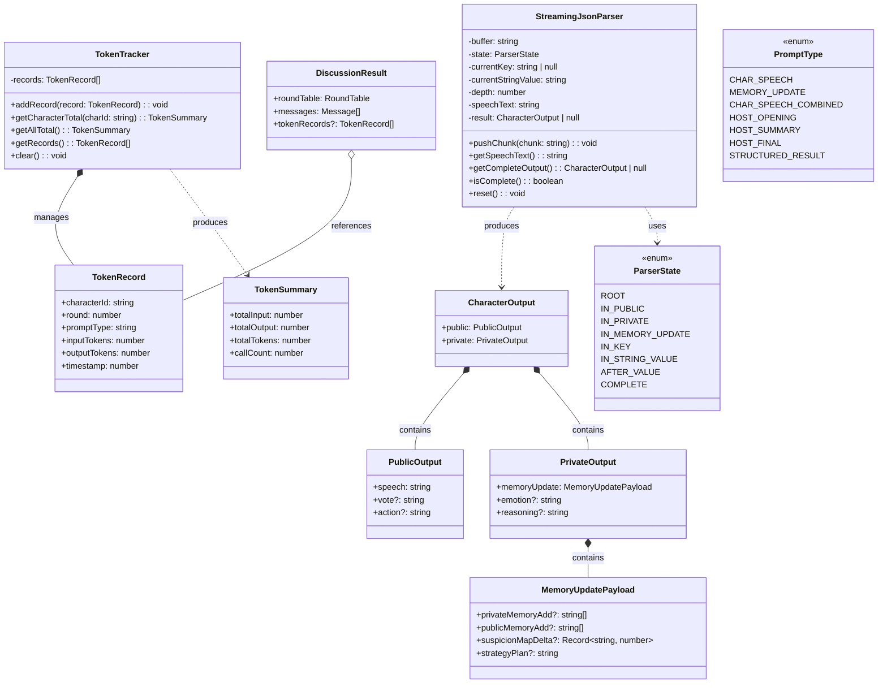
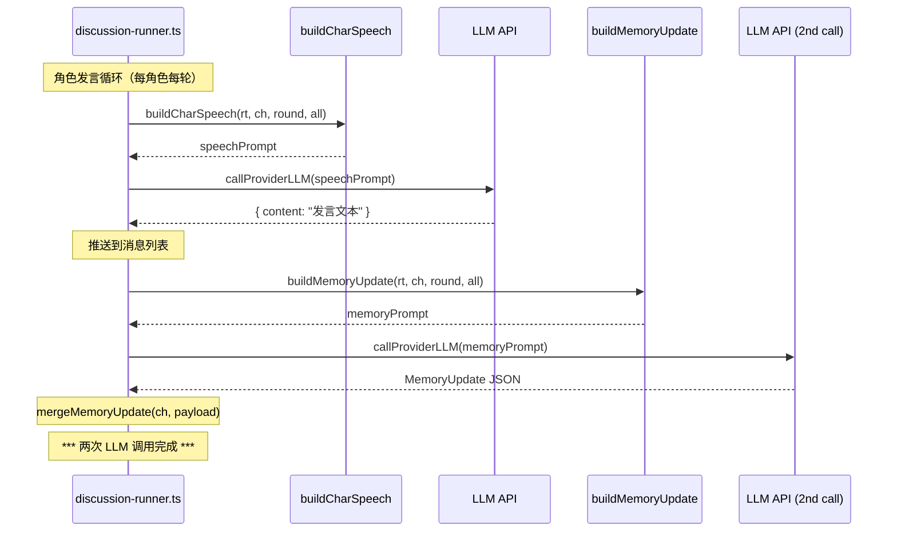
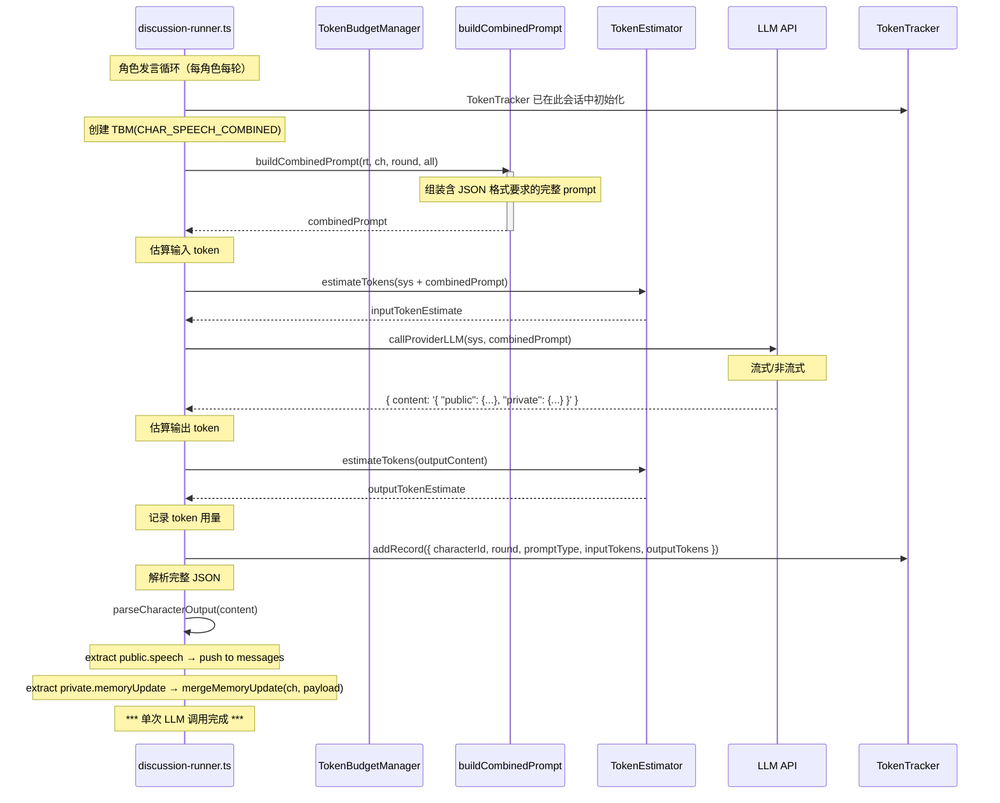
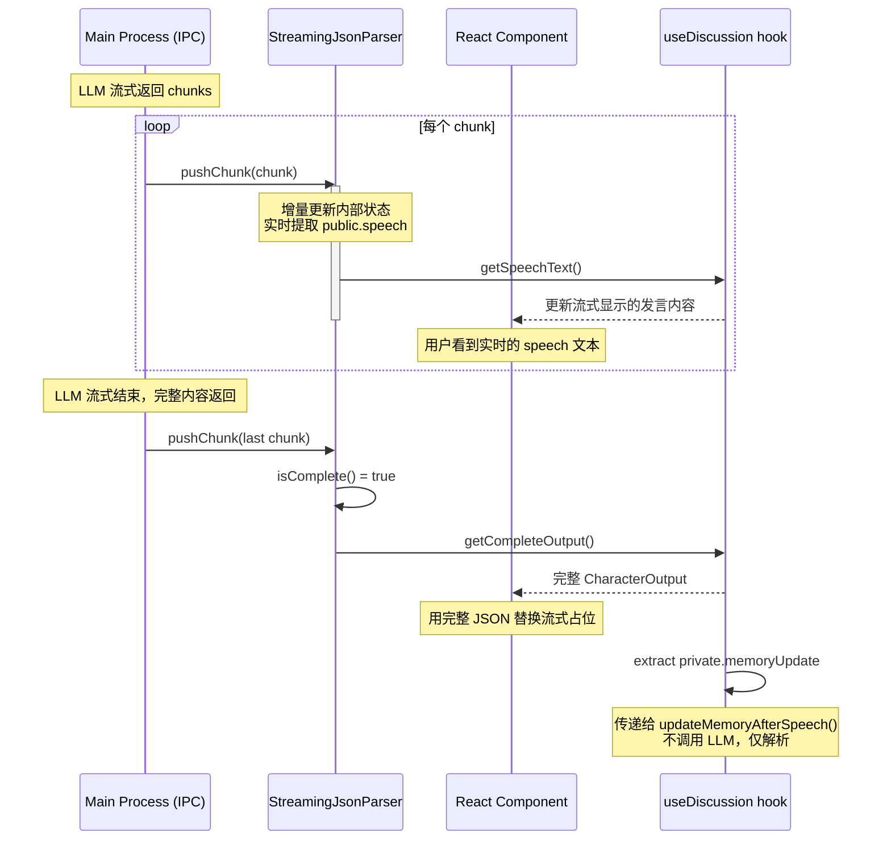
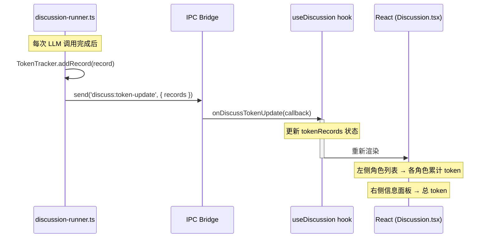
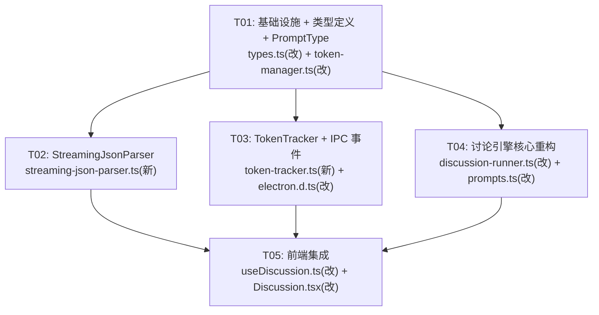

# AI 圆桌讨论 — 引擎重构方案：一次调用 + 双层 JSON 输出 + Token 用量追踪

> 设计者：Bob（Architect）  
> 日期：2025-07-17  
> 版本：v1.0

---

## 目录

1. [实现方案 + 框架选型](#1-实现方案--框架选型)
2. [文件变更清单](#2-文件变更清单)
3. [数据结构和接口（类图）](#3-数据结构和接口类图)
4. [程序调用流程（时序图）](#4-程序调用流程时序图)
5. [待明确事项](#5-待明确事项)
6. [依赖包列表](#6-依赖包列表)
7. [任务列表](#7-任务列表)
8. [共享知识](#8-共享知识)
9. [任务依赖图](#9-任务依赖图)

---

## 1. 实现方案 + 框架选型

### 1.1 核心技术挑战

| 挑战 | 说明 |
|------|------|
| **两次 LLM 调用 → 一次调用** | 当前每角色每轮需两次调用（发言 + 记忆更新）。合并后 prompt 变长，输出格式变复杂，需确保 LLM 能稳定输出结构化 JSON |
| **流式 JSON 解析困难** | 流式传输时收到的只是字符片段，无法直接 `JSON.parse()`；需实时提取 `public.speech` 字段展示，同时容忍残缺 JSON |
| **Token 用量追踪** | 需要记录每次 LLM 调用的输入/输出 token 估算值，关联到角色和轮次，在 UI 上累计展示 |
| **移除 8000 硬上限** | 全局 `HARD_TOKEN_LIMIT = 8000` 需移除，改依赖 `TokenBudgetManager` 的按类型预算控制 |
| **Host 保持独立** | Host 的 prompt 和输出格式不变，不参与 public/private JSON 格式 |

### 1.2 框架选型决策

| 选项 | 决策 | 理由 |
|------|------|------|
| **前端流式 JSON 解析器** | **✅ 自实现** | 不引入新依赖。基于增量 JSON 解析思路，在接收 chunk 时维护解析状态机，实时提取 `public.speech` |
| **现有 Token 估算** | **✅ 复用** | `TokenEstimator.estimateTokens()` 已存在并投入生产，直接复用 |
| **现有 TokenBudgetManager** | **✅ 复用** | 已实现三级降级策略，新增 `CHAR_SPEECH_COMBINED` PromptType 即可 |
| **新依赖** | **❌ 不引入** | 本次重构不引入任何第三方包 |

### 1.3 详细设计方案

#### 1.3.1 合并后的单次调用流程

```
之前（两次调用）：
  buildCharSpeech(rt, c, round, all)  →  callProviderLLM()  →  { content: "发言文本" }
  buildMemoryUpdate(rt, c, round, all) →  callProviderLLM()  →  MemoryUpdate JSON

之后（一次调用）：
  buildCombinedPrompt(rt, c, round, all) →  callProviderLLM()  →  {
    "public":    { "speech": "发言文本" },
    "private":   { "memoryUpdate": { ... } }
  }
```

#### 1.3.2 统一输出 JSON Schema（`CharacterOutput`）

```
{
  "public": {
    "speech": "<角色发言文本>",         // 必填，用于实时显示
    "vote": "<投票目标角色ID>",         // 未来扩展
    "action": "<特殊行动描述>"          // 未来扩展
  },
  "private": {
    "memoryUpdate": {                   // 必填
      "privateMemoryAdd": ["..."],      // 可选，最多3条，每条≤40字
      "publicMemoryAdd": ["..."],       // 可选，最多3条，每条≤40字
      "suspicionMapDelta": { "charId": 15 },  // 可选
      "strategyPlan": "..."             // 可选
    },
    "emotion": "<当前情绪>",            // 未来扩展
    "reasoning": "<推理过程>"           // 未来扩展
  }
}
```

**设计原则**：
- `public.speech` 和 `private.memoryUpdate` 都是**必填**
- `public` 和 `private` 根级字段本身必填
- 其余字段均为可选，解析器对缺失字段优雅降级

#### 1.3.3 Prompt 改造

合并后的角色 prompt 末尾添加 JSON 格式要求。具体见 T04 的详细描述。

#### 1.3.4 流式 JSON 解析策略

```
收到 chunk "{\"public\":"
  → 无 speech 字段，不展示
收到 chunk "{\"speech\":\"关于这个"
  → speech 字段开始出现，累积 "关于这个"
收到 chunk "问题，我认为..."
  → 追加到当前 speech: "关于这个问题，我认为..."
...
最终完整 JSON 到达后:
  → JSON.parse() 完整解析
  → 提取 public.speech → 最终发言
  → 提取 private.memoryUpdate → 更新记忆
```

**边界情况**：
1. **字符串跨 chunk 边界**：解析器跟踪当前 key，跨 chunk 累积字符串值
2. **嵌套对象未闭合**：只提取已完成的字段
3. **转义字符**：正确处理 `\"`、`\\`、`\n`
4. **markdown 代码块**：自动去除 ` ```json ` 和 ` ``` `
5. **流结束未收到完整 JSON**：使用当前最完整 speech，private 部分静默丢弃

#### 1.3.5 Token 用量追踪

```
每次 LLM 调用后:
  1. inputTokens = TokenEstimator.estimateTokens(sysPrompt + userPrompt)
  2. outputTokens = TokenEstimator.estimateTokens(outputContent)
  3. 记录 { characterId, round, promptType, inputTokens, outputTokens }
  4. 追加到 TokenTracker.records[]
  5. IPC 推送讨论:token-update → 前端更新 UI
```

#### 1.3.6 Host 保持独立

- Host 的 prompt builder **不变**
- Host 输出不经过 CharacterOutput 解析，保持纯文本
- Host 仍记录 token 用量（计入总用量 UI）
- Host 不参与 public/private JSON 格式

#### 1.3.7 移除 HARD_TOKEN_LIMIT = 8000

- 删除 `const HARD_TOKEN_LIMIT = 8000` 常量和 `callLlm` 中的全局截断逻辑
- Token 预算完全交由 `TokenBudgetManager` 按类型管理

---

## 2. 文件变更清单

### 2.1 新建文件

| # | 相对路径 | 说明 |
|---|---------|------|
| 1 | `src/lib/streaming-json-parser.ts` | 前端流式 JSON 解析器：`StreamingJsonParser` 类 |
| 2 | `src/lib/token-tracker.ts` | Token 用量追踪器：`TokenTracker` 类 |

### 2.2 修改文件

| # | 相对路径 | 改动范围 |
|---|---------|---------|
| 3 | `src/lib/types.ts` | 新增 `PublicOutput`、`PrivateOutput`、`CharacterOutput`、`TokenRecord`；修改 `DiscussionResult` 增加 `tokenRecords` |
| 4 | `src/lib/prompts.ts` | 新增 `buildCombinedCharacterPrompt()`；标记 `buildMemoryUpdatePrompt()` 为 `@deprecated` |
| 5 | `electron/discussion-runner.ts` | **核心改动**：新增 `buildCombinedPrompt()`；TokenTracker 集成；删 HARD_TOKEN_LIMIT；角色循环改为一次调用 |
| 6 | `src/lib/token-manager.ts` | 新增 `CHAR_SPEECH_COMBINED` PromptType + 预算值 |
| 7 | `src/types/electron.d.ts` | 新增 `discuss:token-update` IPC 事件声明 |
| 8 | `src/hooks/useDiscussion.ts` | 流式处理改用 StreamingJsonParser；新增 tokenRecords 状态 |
| 9 | `src/pages/Discussion.tsx` | 角色列表 + 信息面板增加 Token 用量展示 |

---

## 3. 数据结构和接口（类图）

### 3.1 classDiagram



### 3.2 TypeScript 接口定义

```typescript
// ===== src/lib/types.ts — 新增 =====

export interface PublicOutput {
  speech: string;
  vote?: string;
  action?: string;
}

export interface PrivateOutput {
  memoryUpdate: {
    privateMemoryAdd?: string[];
    publicMemoryAdd?: string[];
    suspicionMapDelta?: Record<string, number>;
    strategyPlan?: string;
  };
  emotion?: string;
  reasoning?: string;
}

export interface CharacterOutput {
  public: PublicOutput;
  private: PrivateOutput;
}

export interface TokenRecord {
  characterId: string;
  round: number;
  promptType: string;     // 'CHAR_SPEECH_COMBINED' | 'HOST_OPENING' | etc.
  inputTokens: number;
  outputTokens: number;
  timestamp: number;
}

// DiscussionResult 修改 — 新增字段
export interface DiscussionResult {
  roundTable: RoundTable;
  messages: Message[];
  tokenRecords?: TokenRecord[];      // ★ 新增
}
```

```typescript
// ===== src/lib/token-tracker.ts — 新增 =====

export interface TokenSummary {
  totalInput: number;
  totalOutput: number;
  totalTokens: number;
  callCount: number;
}

export class TokenTracker {
  private records: TokenRecord[] = [];

  addRecord(record: TokenRecord): void;
  getCharacterTotal(charId: string): TokenSummary;
  getAllTotal(): TokenSummary;
  getRecords(): TokenRecord[];
  clear(): void;
}
```

```typescript
// ===== src/lib/streaming-json-parser.ts — 新增 =====

enum ParserState {
  ROOT, IN_PUBLIC, IN_PRIVATE, IN_MEMORY_UPDATE,
  IN_KEY, IN_STRING_VALUE, AFTER_VALUE, COMPLETE
}

export class StreamingJsonParser {
  private buffer: string = '';
  private state: ParserState = ParserState.ROOT;
  private currentKey: string | null = null;
  private currentStringValue: string = '';
  private depth: number = 0;
  private speechText: string = '';
  private result: CharacterOutput | null = null;

  pushChunk(chunk: string): void;               // 增量解析
  getSpeechText(): string;                       // 实时提取 public.speech
  getCompleteOutput(): CharacterOutput | null;   // 完整 JSON
  isComplete(): boolean;                         // 是否完整闭合
  reset(): void;                                 // 重置
}
```

---

## 4. 程序调用流程（时序图）

### 4.1 旧架构：两次调用流程



### 4.2 新架构：一次调用流程



### 4.3 流式 JSON 解析流程



### 4.4 Token 用量更新到 UI



---

## 5. 待明确事项

### 5.1 需产品/团队决策

| # | 事项 | 建议方案 | 需要决策 |
|---|------|---------|---------|
| 1 | **LLM 输出的 JSON 格式不稳定时** | 回退策略：① 用 `parseJsonPayload` 兼容解析（去代码块围栏）② 如果提取不到 `public.speech`，回退到用全部文本做发言 ③ 如果提取不到 `private.memoryUpdate`，跳过本轮记忆更新 | 回退策略是否接受？ |
| 2 | **Token 用量 UI 布局** | ① 角色列表中每个角色名旁显示「⧖ 1.2k」格式 ② 右侧信息面板底部增加 token 用量汇总 | 需设计师确认 |
| 3 | **输出 token 估算** | 使用 `outputContent.length` 字符数估算，与输入方法一致 | 是否需要更精确的方法？ |

### 5.2 技术待验证

| # | 事项 | 说明 |
|---|------|------|
| 4 | **合并 prompt 的 LLM 输出稳定性** | 需验证主流 LLM 是否能稳定输出 JSON 格式。建议在 mock provider 中增加 JSON 格式输出模拟 |
| 5 | **流式 JSON 解析性能** | 高频 chunk 时 `pushChunk` 可能频繁触发 React 重渲染。优化：限制更新频率（throttle）或在批量 chunk 到来时合并更新 |

### 5.3 假设

- 主流 LLM（GPT-4, Claude 3）可以在单次调用中同时输出高质量发言和结构化记忆更新
- `buildMemoryUpdatePrompt` 标记为废弃但保留，以便在极端情况下降级回两次调用

---

## 6. 依赖包列表

### 6.1 新增依赖

无。本次重构不引入任何第三方包。

### 6.2 使用现有依赖

| 模块 | 用途 |
|------|------|
| `TokenEstimator` (token-estimator.ts) | 输入/输出 token 估算 |
| `TokenBudgetManager` (token-manager.ts) | budget 检查 + 降级 |

---

## 7. 任务列表

### 7.1 任务总览

| Task ID | 任务名称 | 源文件 | 依赖 | 优先级 | 性质 |
|---------|---------|--------|------|--------|------|
| T01 | **项目基础设施 + 类型定义 + PromptType** | `src/lib/types.ts`(改), `src/lib/token-manager.ts`(改) | 无 | P0 | 修改 |
| T02 | **StreamingJsonParser 流式 JSON 解析器** | `src/lib/streaming-json-parser.ts`(新) | T01 | P0 | 新增 |
| T03 | **TokenTracker 用量追踪器 + IPC 事件** | `src/lib/token-tracker.ts`(新), `src/types/electron.d.ts`(改) | T01 | P0 | 新增+修改 |
| T04 | **讨论引擎核心重构（主进程 + prompts）** | `electron/discussion-runner.ts`(改), `src/lib/prompts.ts`(改) | T01 | P0 | 修改 |
| T05 | **前端集成：流式解析 + Token UI** | `src/hooks/useDiscussion.ts`(改), `src/pages/Discussion.tsx`(改) | T02, T03, T04 | P0 | 修改 |

### 7.2 任务详细描述

#### T01: 项目基础设施 + 类型定义 + PromptType

**涉及的源文件**：
- `src/lib/types.ts`（修改）
- `src/lib/token-manager.ts`（修改）

**改动内容**：

`src/lib/types.ts` 新增：
```
- PublicOutput 接口（speech: string; vote?, action?）
- PrivateOutput 接口（memoryUpdate: MemoryUpdatePayload; emotion?, reasoning?）
- CharacterOutput 接口（public: PublicOutput; private: PrivateOutput）
- TokenRecord 接口（characterId, round, promptType, inputTokens, outputTokens, timestamp）
- DiscussionResult 接口追加 tokenRecords?: TokenRecord[]
```

`src/lib/token-manager.ts` 新增：
```
- PromptType 新增 CHAR_SPEECH_COMBINED
- TOKEN_BUDGET_DEFAULTS 新增 [PromptType.CHAR_SPEECH_COMBINED]: 5000
```

**验证标准**：
- 类型定义编译通过（`npx tsc --noEmit` 无错误）
- 新增 PromptType 可在现有 `TokenBudgetManager.create()` 中正常使用

**依赖**：无

---

#### T02: StreamingJsonParser 流式 JSON 解析器

**涉及的源文件**：
- `src/lib/streaming-json-parser.ts`（新建）

**改动内容**：

```
StreamingJsonParser 类：
  - ParserState 枚举（ROOT, IN_PUBLIC, IN_PRIVATE, IN_MEMORY_UPDATE, IN_KEY, IN_STRING_VALUE, AFTER_VALUE, COMPLETE）
  - pushChunk(chunk: string): void — 增量解析，维护状态机
  - getSpeechText(): string — 实时返回当前累积的 public.speech
  - getCompleteOutput(): CharacterOutput | null — 完整 JSON 解析后返回
  - isComplete(): boolean — 是否已收到完整闭合 JSON
  - reset(): void — 重置

兼容处理：
  - 自动去除 markdown 代码块围栏（ ```json / ``` ）
  - 正确处理字符串转义字符（ \" \\ \n \t 等）
  - 容忍嵌套对象未闭合
```

**解析状态机要点**：
```
1. 字符级状态机，跟踪 depth 判断嵌套层级
2. 检测到 "public" → "speech" 路径后开始累积字符串值
3. 字符串值支持 \" 转义
4. depth 回到 0 且匹配到 "}}" 标记 COMPLETE
5. 不依赖 regex，纯字符逐位解析，对残缺 JSON 友好
```

**验证标准**：
- 能正确解析跨越 chunk 边界的字符串值
- 能处理转义字符（`\"` → `"`）
- 能自动去除 markdown 代码块围栏
- isComplete() 在完整 JSON 到达前保持 false
- getSpeechText() 在完整 JSON 到达前返回逐步累积的文本

**依赖**：T01（类型定义）

---

#### T03: TokenTracker 用量追踪器 + IPC 事件

**涉及的源文件**：
- `src/lib/token-tracker.ts`（新建）
- `src/types/electron.d.ts`（修改）

**改动内容**：

`src/lib/token-tracker.ts`：
```
- TokenSummary 接口（totalInput, totalOutput, totalTokens, callCount）
- TokenTracker 类：
  - addRecord(record: TokenRecord): void
  - getCharacterTotal(charId: string): TokenSummary
  - getAllTotal(): TokenSummary
  - getRecords(): TokenRecord[]
  - clear(): void
```

`src/types/electron.d.ts`：
```
- ElectronAPI 新增：
  onDiscussTokenUpdate: (callback: (data: { records: TokenRecord[] }) => void) => () => void;
```

**验证标准**：
- addRecord 后 getCharacterTotal 返回正确累计值
- 多角色场景下各角色用量独立统计
- clear() 后所有计数归零

**依赖**：T01（类型定义）

---

#### T04: 讨论引擎核心重构（主进程 + prompts）

**涉及的源文件**：
- `electron/discussion-runner.ts`（修改）
- `src/lib/prompts.ts`（修改）

**改动内容**：

**`electron/discussion-runner.ts`**：

1. **删除硬上限**：
   - 移除 `const HARD_TOKEN_LIMIT = 8000`
   - 移除 `callLlm` 中基于 `HARD_TOKEN_LIMIT` 的全局截断逻辑（约 640-652 行）

2. **新增 `buildCombinedPrompt()`**：
   - 签名：`function buildCombinedPrompt(rt, c, round, msgs, hf?): string`
   - 使用 `CHAR_SPEECH_COMBINED` PromptType 创建 TokenBudgetManager
   - 组装逻辑 = buildCharSpeech 的上下文 + buildMemoryUpdate 的 JSON 输出格式
   - 末尾附加 JSON 输出要求（见 1.3.3 节）

3. **新增 `parseCharacterOutput(text: string): CharacterOutput | null`**：
   - 复用 `parseJsonPayload` 的兼容解析逻辑（去代码块围栏、找 {}）
   - 对缺失字段做默认值填充（空字符串、空数组等）

4. **修改角色发言循环（startDiscussion）**：
   - 在 startDiscussion 开头初始化 `const tokenTracker = new TokenTracker();`
   - 原 `buildCharSpeech` + `updateMemoryAfterSpeech` 改为对每个角色调用 `buildCombinedPrompt` → `callLlm` → `parseCharacterOutput` → `mergeMemoryUpdate`
   - 在 `callLlm` 前后分别估算 input/output tokens 并 `tokenTracker.addRecord()`
   - 通过 IPC 推送 `discuss:token-update` 事件
   - 讨论结束时将 `tokenTracker.getRecords()` 存入 `DiscussionResult`

5. **修改 `appendRound`**：同样的改动同步到 appendRound 的角色发言循环

6. **修改 `updateMemoryAfterSpeech`**：
   - 改为接受 `CharacterOutput` 参数
   - 直接从 `output.private.memoryUpdate` 提取并调用 `mergeMemoryUpdate`
   - 不再调用 `buildMemoryUpdate` 和 `callLlm`

**`src/lib/prompts.ts`**：

1. **新增 `buildCombinedCharacterPrompt()`**：
   - 签名同 `buildCharacterSpeechPrompt`
   - 内部使用 `CHAR_SPEECH_COMBINED` 的 TBM
   - prompt 末尾包含完整的 JSON 输出格式说明

2. **标记 `buildMemoryUpdatePrompt()` 为 @deprecated**：
   - 保留函数，添加 JSDoc 注释 `@deprecated Use buildCombinedCharacterPrompt instead`

**验证标准**：
- 讨论正常运行，角色发言正确展示
- 角色记忆正常更新（与重构前效果一致）
- Host 输出保持纯文本不变
- 无 `[TokenBudget] 全局硬上限触发` 日志出现
- Token 记录正确生成并通过 IPC 推送到前端

**依赖**：T01（类型定义 + PromptType）

---

#### T05: 前端集成：流式解析 + Token UI

**涉及的源文件**：
- `src/hooks/useDiscussion.ts`（修改）
- `src/pages/Discussion.tsx`（修改）

**改动内容**：

**`src/hooks/useDiscussion.ts`**：

1. **流式处理改造**：
   - 引入 `StreamingJsonParser`
   - `onDiscussStreamChunk` 回调中：`parser.pushChunk(chunk)` + `parser.getSpeechText()` 更新 streaming content
   - `onDiscussStreamEnd` 回调中：用 `parser.getCompleteOutput().public.speech` 替换占位消息
   - 提取 `private.memoryUpdate`，通过 IPC 调用 `electronAPI.discussUpdateMemory(roundTableId, characterId, memoryUpdate)`
   - 如 `isComplete()` 为 false，回退到用当前累积文本

2. **新增 Token 状态**：
   - `useState<TokenRecord[]> tokenRecords`
   - 监听 `onDiscussTokenUpdate` 事件，累积更新 tokenRecords
   - 导出 `tokenRecords` 供 UI 使用
   - 导出辅助函数 `getCharacterTokenSummary(charId)` 返回 `TokenSummary`

3. **新 IPC 事件监听注册**：
   - `const unsubToken = window.electronAPI.onDiscussTokenUpdate((data) => { ... })`
   - 在 `startDiscussion` / `appendRound` 中注册
   - 在 cleanup 中取消注册

**`src/pages/Discussion.tsx`**：

1. **左侧角色列表改造**：
   - 每个角色项中显示 token 用量
   - 格式：`<span className="text-xs text-gray-400">⧖ {formatTokens(summary.totalTokens)}</span>`
   - `formatTokens(n)`: n < 1000 → 直接显示数字；n ≥ 1000 → 显示 "1.2k"
   - 实时更新（每次 `tokenRecords` 状态变化时重新渲染）

2. **右侧信息面板改造**：
   - "讨论信息" 面板底部增加 Token 用量汇总区
   ```
   <div className="mt-4 pt-4 border-t border-gray-200">
     <h4 className="text-xs font-medium text-gray-500 mb-2">Token 用量</h4>
     <div className="text-xs space-y-1">
       <div className="flex justify-between">
         <span className="text-gray-400">总输入</span>
         <span className="text-gray-700">{formatTokens(allTotal.totalInput)}</span>
       </div>
       <div className="flex justify-between">
         <span className="text-gray-400">总输出</span>
         <span className="text-gray-700">{formatTokens(allTotal.totalOutput)}</span>
       </div>
       <div className="flex justify-between font-medium">
         <span className="text-gray-500">总计</span>
         <span className="text-gray-900">{formatTokens(allTotal.totalTokens)}</span>
       </div>
       <div className="flex justify-between text-gray-400">
         <span>调用次数</span>
         <span>{allTotal.callCount}</span>
       </div>
     </div>
   </div>
   ```

3. **角色用量明细**（可选，折叠区域）：
   ```
   <details className="mt-2">
     <summary className="text-xs text-gray-400 cursor-pointer hover:text-gray-600">各角色明细</summary>
     {roundTable.characters.map(char => (
       <div key={char.id} className="flex justify-between text-xs text-gray-400 mt-1">
         <span>{char.name}</span>
         <span>{formatTokens(getCharacterTokenSummary(char.id).totalTokens)}</span>
       </div>
     ))}
   </details>
   ```

**验证标准**：
- 流式传输时 speech 实时显示
- 完整 JSON 到达后替换为准确内容
- 角色列表中各角色 token 用量正确更新
- 右侧面板总用量正确更新
- Host 的 token 用量计入总用量

**依赖**：T02（StreamingJsonParser）, T03（TokenTracker + IPC）, T04（引擎核心重构）

---

## 8. 共享知识

### 8.1 JSON 命名约定

```
- 所有 JSON 字段使用 camelCase（speech, memoryUpdate, privateMemoryAdd, suspicionMapDelta）
- 角色 ID 使用字符串，保持与 Character.id 一致
- 时间戳使用 Unix 毫秒（Date.now()）
- token 计数值使用 number 类型
```

### 8.2 跨文件常量

```typescript
// token-manager.ts — 新增
PromptType.CHAR_SPEECH_COMBINED  // "CHAR_SPEECH_COMBINED"
TOKEN_BUDGET_DEFAULTS[PromptType.CHAR_SPEECH_COMBINED] = 5000
```

### 8.3 JSON 解析回退策略

所有 `CharacterOutput` 解析点（主进程 + 渲染进程）遵循以下回退策略：

```
1. 首先尝试 JSON.parse()（去代码块围栏后的干净文本）
2. 如果失败，尝试 parseJsonPayload 兼容解析（找 { } 边界）
3. 如果还失败：
   - public.speech ← 原始文本（LLM 返回的全部内容）
   - private.memoryUpdate ← {}（空更新）
4. 记 warn 日志：`[CharacterOutput] Failed to parse: ${text.slice(0, 100)}...`
```

### 8.4 StreamingJsonParser 线程安全

- `StreamingJsonParser` 只在渲染进程主线程使用，不涉及跨线程共享
- 不需要锁或原子操作
- 每个 `StreamingJsonParser` 实例处理一个角色的输出
- 不同角色使用不同的 parser 实例

### 8.5 IPC 事件命名约定

```
新增的 IPC 事件:
- discuss:token-update: { records: TokenRecord[] }
- discuss:memory-update: { roundTableId, characterId, memoryUpdate }
```

### 8.6 旧字段兼容

```
- buildMemoryUpdate / buildMemoryUpdatePrompt → @deprecated 但保留
- MEMORY_UPDATE PromptType → 保留（兼容现有逻辑）
- Character 中的 memory 字段结构不变
- Message.content 始终保持为纯文本字符串（解析后的 speech）
```

---

## 9. 任务依赖图

