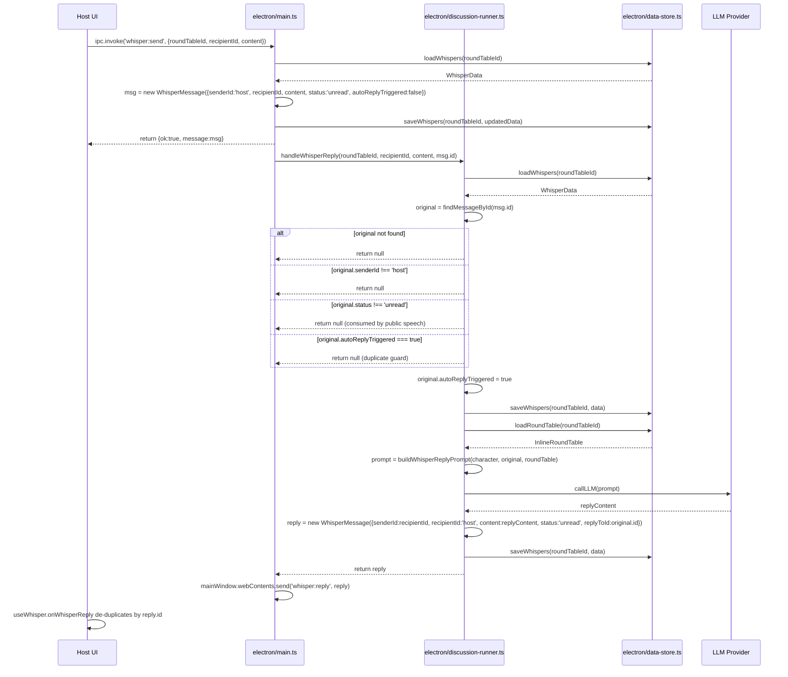

# System Design: Whisper System Anti-Infinite-Loop Guard (WAIL-Guard)

> **版本**: v0.1
> **作者**: Bob（Architect）
> **日期**: 2025-07-18
> **基于 PRD**: `PRD-whisper-system.md`
> **关联文档**: `ARCH-whisper-system.md`, `docs/whisper-system-anti-loop-design.md`

---

## Part A: System Design

### 1. Implementation Approach

#### 1.1 Core Technical Challenges

| Challenge | Description |
|-----------|-------------|
| Bidirectional 1:1 whisper loops | Host sends a whisper → AI replies → if the system treats the AI reply as a new trigger, it could call the LLM again indefinitely. |
| Group chat message storms | One host group message could trigger member A, whose reply triggers member B, whose reply triggers member C, etc. |
| Side effects in pure functions | `buildCharSpeech` must remain a pure prompt builder; whisper state changes (marking as `read`) must happen in the caller. |
| Host control | The host must retain explicit control over whether and when AI characters auto-reply. |
| Natural silence | The system should guide the LLM to choose silence organically rather than relying on hard-coded rejection rules. |

#### 1.2 Framework and Library Selections

| Layer | Selection | Justification |
|-------|-----------|---------------|
| Frontend | Existing React + MUI + Tailwind | Zero new dependencies; reuse `WhisperPanel`, `OneOnOneTab`, `GroupTab`. |
| State management | Existing `useWhisper.ts` hook | Extend with de-duplication and group-control toggles. |
| Backend | Existing Electron main process + `discussion-runner.ts` | Extend existing handlers and reply functions; no new services. |
| Storage | Existing `{filename}_whispers.json` via `data-store.ts` | Add new optional fields without migration. |
| LLM integration | Existing provider abstraction in `discussion-runner.ts` | Reuse prompt builders and API call flow. |

#### 1.3 Architecture Patterns

- **MVC-style separation**: React components (View) ↔ `useWhisper` hook (Controller) ↔ IPC/main process + `discussion-runner` (Model/Service).
- **Event-driven IPC**: `whisper:send` / `whisper:reply` / `whisper:send-group` / `whisper:group-reply` for decoupled UI/backend communication.
- **Deterministic guard layer (WAIL-Guard)**: A thin set of checks at the entry points of `handleWhisperReply` and `handleGroupWhisperReply` to block loops before LLM calls are made.
- **Pure prompt builders**: `buildCharSpeech` and `buildWhisperReplyPrompt` remain pure; state mutations live in the orchestration layer (`startDiscussion`, `appendRound`, `handleWhisperReply`).

---

### 2. File List

#### 2.1 Modified Files

| File Path | Purpose |
|-----------|---------|
| `src/lib/types.ts` | Extend `WhisperMessage` and `WhisperGroup` with anti-loop fields. |
| `electron/types.ts` | Sync inline types if separated from `src/lib/types.ts`. |
| `electron/main.ts` | Register/update `whisper:send` and `whisper:send-group` handlers; set `autoReplyTriggered=false` on host whispers; gate group replies on `autoReplyEnabled`. |
| `electron/discussion-runner.ts` | Add WAIL-Guard checks to `handleWhisperReply`; add `handleGroupWhisperReply`; keep `injectWhisperContext` pure. |
| `electron/data-store.ts` | Ensure `loadWhispers`/`saveWhispers` preserve new optional fields. |
| `src/hooks/useWhisper.ts` | De-duplicate incoming replies; expose group-control helpers. |
| `src/components/WhisperPanel.tsx` | Disable input when not paused; show guard status hints. |
| `src/components/OneOnOneTab.tsx` | (P1) Add per-character auto-reply toggle. |
| `src/components/GroupTab.tsx` | (P1) Add group auto-reply toggle, manual trigger button, round count display. |

#### 2.2 New Files

| File Path | Purpose |
|-----------|---------|
| `docs/whisper-system-anti-loop-design.md` | Narrative design document (already produced; contains rules, diagrams, and QA checklist). |
| `docs/system_design.md` | This formal design document. |
| `docs/sequence-diagram.mermaid` | Extracted sequence diagrams for key flows. |
| `docs/class-diagram.mermaid` | Extracted class diagram for data models and services. |

---

### 3. Data Structures and Interfaces

```mermaid
classDiagram
    class WhisperMessage {
        +string id
        +string senderId
        +string recipientId
        +string content
        +"sent" | "unread" | "read" status
        +string? replyToId
        +Date createdAt
        +boolean? autoReplyTriggered
    }

    class WhisperGroup {
        +string id
        +string name
        +string[] memberIds
        +string ownerId
        +Date createdAt
        +boolean? autoReplyEnabled
        +number? replyRoundCount
    }

    class WhisperData {
        +WhisperMessage[] messages
        +WhisperGroup[] groups
        +Date updatedAt
    }

    class InlineRoundTable {
        +string id
        +string topic
        +InlineCharacter[] characters
        +RuleSet ruleSet
        +Date createdAt
    }

    class InlineCharacter {
        +string id
        +string name
        +string profile
        +string? avatar
    }

    class RuleSet {
        +string? model
        +number? whisperReplyCooldownMs
        +number? groupReplyCooldownMs
    }

    class WhisperService {
        +Promise~WhisperMessage|null~ handleWhisperReply(roundTableId: string, recipientId: string, whisperContent: string, originalMessageId: string)
        +Promise~void~ handleGroupWhisperReply(roundTableId: string, groupId: string, content: string, originalMessageId: string)
        +{ text: string, readIds: string[] } injectWhisperContext(characterId: string, allWhispers: WhisperMessage[])
        +string buildWhisperReplyPrompt(character: InlineCharacter, original: WhisperMessage, roundTable: InlineRoundTable)
        +string buildWhisperGroupReplyPrompt(character: InlineCharacter, group: WhisperGroup, original: WhisperMessage, roundTable: InlineRoundTable)
    }

    class DataStore {
        +Promise~WhisperData~ loadWhispers(roundTableId: string)
        +Promise~void~ saveWhispers(roundTableId: string, data: WhisperData)
        +Promise~InlineRoundTable~ loadRoundTable(roundTableId: string)
    }

    class MainProcessHandlers {
        +void registerIpcHandlers()
        +Promise~object~ whisperSend(event, args)
        +Promise~object~ whisperSendGroup(event, args)
        +void emitWhisperReply(win, reply: WhisperMessage)
        +void emitWhisperGroupReply(win, reply: WhisperMessage)
    }

    class UseWhisperHook {
        +WhisperData data
        +function sendWhisper(recipientId: string, content: string)
        +function sendGroupWhisper(groupId: string, content: string)
        +function toggleGroupAutoReply(groupId: string)
        +function markWhisperRead(messageId: string)
    }

    WhisperData "1" *-- "*" WhisperMessage : contains
    WhisperData "1" *-- "*" WhisperGroup : contains
    WhisperMessage --> WhisperMessage : replyToId
    WhisperGroup --> WhisperMessage : messages by groupId (implicit)
    WhisperService ..> DataStore : uses
    WhisperService ..> InlineRoundTable : uses
    WhisperService ..> InlineCharacter : uses
    WhisperService ..> WhisperMessage : produces/consumes
    MainProcessHandlers ..> WhisperService : invokes
    UseWhisperHook ..> MainProcessHandlers : calls via IPC
```

---

### 4. Program Call Flow

#### 4.1 1:1 Whisper Send with WAIL-Guard



#### 4.2 Group Whisper Send (MVP Default No Auto-Reply)

```mermaid
sequenceDiagram
    participant UI as Host UI
    participant Main as electron/main.ts
    participant Store as electron/data-store.ts

    UI->>Main: ipc.invoke('whisper:send-group', {roundTableId, groupId, content})
    Main->>Store: loadWhispers(roundTableId)
    Store-->>Main: WhisperData
    Main->>Main: msg = new WhisperMessage({senderId:'host', recipientId:groupId, content, status:'unread'})
    Main->>Store: saveWhispers(roundTableId, updatedData)
    Main-->>UI: return {ok:true, message:msg}
    alt group.autoReplyEnabled === true (P1)
        Main->>Runner: handleGroupWhisperReply(...)
        Runner->>Runner: check replyRoundCount / cooldown
        Runner->>Runner: group.replyRoundCount += 1
        Runner->>LLM: per-member prompts
        LLM-->>Runner: replies
        Runner-->>Main: emit 'whisper:group-reply' per reply
    else MVP default false
        Note over Main,Store: No LLM call; only host message persisted.
    end
```

#### 4.3 Public Speech Whisper Context Injection and Read Marking

```mermaid
sequenceDiagram
    participant Loop as startDiscussion/appendRound
    participant Runner as electron/discussion-runner.ts
    participant Store as electron/data-store.ts
    participant LLM as LLM Provider

    Loop->>Runner: injectWhisperContext(characterId, allWhispers)
    Runner->>Runner: pending = filter(senderId='host' && recipientId=characterId && status='unread')
    Runner->>Runner: return {text:contextParagraph, readIds:pending.map(w=>w.id)}
    Loop->>Runner: buildCharSpeech(character, history, whisperContext.text)
    Runner-->>Loop: speech prompt
    Loop->>LLM: callLLM(speechPrompt)
    LLM-->>Loop: speechContent
    Loop->>Store: loadWhispers(roundTableId)
    Loop->>Loop: for id in readIds: mark message status='read'
    Loop->>Store: saveWhispers(roundTableId, updatedData)
```

---

### 5. Anything UNCLEAR

1. **Migration of existing whisper files**: Existing `_whispers.json` files will not have `autoReplyTriggered`, `autoReplyEnabled`, or `replyRoundCount`. The implementation treats these as optional with safe defaults (`false` / `0`). No explicit migration is required.
2. **Group reply ordering**: The P1 group auto-reply assumes members reply in `speakOrder` (or group member order). If concurrency is desired, the design is compatible but ordering must be deterministic for testability.
3. **Silence representation**: When probability/cooling causes a character to remain silent, the P1 design allows either no push or a placeholder message. The default should be "no push" to avoid cluttering the UI.
4. **Audit logging**: WAIL-Guard block reasons should be logged to the main-process console for QA. A structured log format is recommended but not specified; the implementation can use `console.warn('[WAIL-Guard] blocked:', reason)`.

---

## Part B: Task Decomposition

### 6. Required Packages

No new third-party packages are required. The feature builds entirely on the existing stack:

- `electron`: IPC and main-process runtime
- `react` / `react-dom`: UI components
- `@mui/material`: UI controls (toggles, buttons, badges)
- `tailwindcss`: styling
- Existing LLM provider configuration inside `discussion-runner.ts`

---

### 7. Task List (ordered by dependency)

#### T01: Infrastructure & Type Contracts
**Task ID**: T01  
**Task Name**: 基础设施与类型契约  
**Source Files**:
- `src/lib/types.ts`
- `electron/types.ts`
- `src/types/electron.d.ts`
- `electron/preload.ts`
**Dependencies**: None  
**Priority**: P0  
**Description**: Extend `WhisperMessage` with `autoReplyTriggered?: boolean` and `WhisperGroup` with `autoReplyEnabled?: boolean` and `replyRoundCount?: number`. Update IPC type declarations and preload bridge for new/updated channels (`whisper:send`, `whisper:send-group`, `whisper:reply`, `whisper:group-reply`, and optional P1 `whisper:trigger-group-reply`).

#### T02: Backend WAIL-Guard Implementation
**Task ID**: T02  
**Task Name**: 后端防循环守卫实现  
**Source Files**:
- `electron/main.ts`
- `electron/discussion-runner.ts`
- `electron/data-store.ts`
**Dependencies**: T01  
**Priority**: P0  
**Description**: Update `whisper:send` handler to persist host whisper with `autoReplyTriggered=false` and asynchronously call `handleWhisperReply(roundTableId, recipientId, content, message.id)`. Harden `handleWhisperReply` with entry guards (original exists, sender is host, status unread, not already triggered). Refactor `injectWhisperContext` to return `{text, readIds}` and move read-marking to `startDiscussion`/`appendRound` callers. For group whispers, save host group message and skip LLM when `autoReplyEnabled` is false.

#### T03: Frontend State & De-duplication
**Task ID**: T03  
**Task Name**: 前端状态管理与去重  
**Source Files**:
- `src/hooks/useWhisper.ts`
- `src/components/WhisperPanel.tsx`
- `src/lib/utils.ts` (if a shared `generateId` or de-dupe helper exists)
**Dependencies**: T01, T02  
**Priority**: P0  
**Description**: Add `reply.id`-based de-duplication in `onWhisperReply` and `onWhisperGroupReply` callbacks. Wire `sendWhisper` and `sendGroupWhisper` to updated IPC signatures. Disable whisper input when discussion is not paused. Display guard hints (e.g., "Auto-reply disabled for this group").

#### T04: UI Controls for Host Override (P1)
**Task ID**: T04  
**Task Name**: 主持人控制开关与群聊增强 UI  
**Source Files**:
- `src/components/OneOnOneTab.tsx`
- `src/components/GroupTab.tsx`
- `src/components/CreateGroupDialog.tsx`
**Dependencies**: T03  
**Priority**: P1  
**Description**: Add per-character 1:1 auto-reply toggle in `OneOnOneTab`. Add group-level `autoReplyEnabled` toggle, round count display, and manual "Continue Next Round" button in `GroupTab`. Ensure new group creation sets `autoReplyEnabled=false` and `replyRoundCount=0` by default.

#### T05: Prompt Engineering & Integration Verification
**Task ID**: T05  
**Task Name**: Prompt 引导与集成验证  
**Source Files**:
- `electron/discussion-runner.ts` (prompt builders)
- `docs/whisper-system-anti-loop-design.md`
- Test/QA scripts or manual checklist
**Dependencies**: T02, T03  
**Priority**: P0  
**Description**: Append natural-silence guidance to 1:1 whisper reply prompt and group whisper reply prompt. Verify end-to-end flow: host whisper triggers exactly one AI reply, rapid re-sends do not duplicate, public-speech consumption marks whispers as read, and group whispers default to no AI reply. Update design docs with any deviations.

---

### 8. Shared Knowledge

- **IPC response shape**: All `whisper:*` invoke handlers return `{ok: boolean, message?: WhisperMessage, error?: string}`.
- **Whisper status lifecycle**: `sent` → `unread` → `read`. Only host messages with `status === 'unread'` can trigger AI replies.
- **Anti-loop fields**:
  - `WhisperMessage.autoReplyTriggered`: set to `true` before LLM call in `handleWhisperReply`; persists across restarts to prevent duplicate triggers.
  - `WhisperGroup.autoReplyEnabled`: defaults to `false`; must be explicitly enabled by the host (P1 UI).
  - `WhisperGroup.replyRoundCount`: increments once per host message that triggers a group reply round.
- **Pure function boundary**: `buildCharSpeech`, `buildWhisperReplyPrompt`, `buildWhisperGroupReplyPrompt`, and `injectWhisperContext` must not mutate state or call `saveWhispers`. All mutations happen in the orchestration functions (`startDiscussion`, `appendRound`, `handleWhisperReply`, `handleGroupWhisperReply`).
- **De-duplication rule**: The renderer must de-duplicate incoming `whisper:reply` / `whisper:group-reply` events by `message.id` because Electron `webContents.send` may be retried or the handler may be registered multiple times during React StrictMode.
- **Default values for legacy data**: Missing optional guard fields are treated as `false` / `0` / undefined; no migration script is required.

---

### 9. Task Dependency Graph

```mermaid
graph TD
    T01[\"T01\\n基础设施与类型契约\"]
    T02[\"T02\\n后端防循环守卫实现\"]
    T03[\"T03\\n前端状态管理与去重\"]
    T04[\"T04\\n主持人控制开关与群聊增强 UI\"]
    T05[\"T05\\nPrompt 引导与集成验证\"]

    T01 --> T02
    T02 --> T03
    T03 --> T04
    T02 --> T05
    T03 --> T05
```
