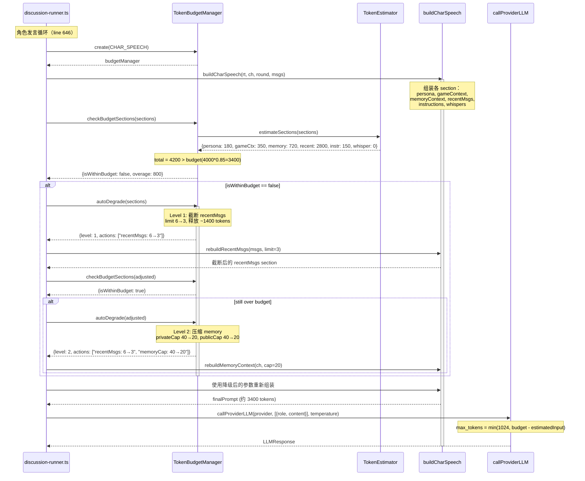
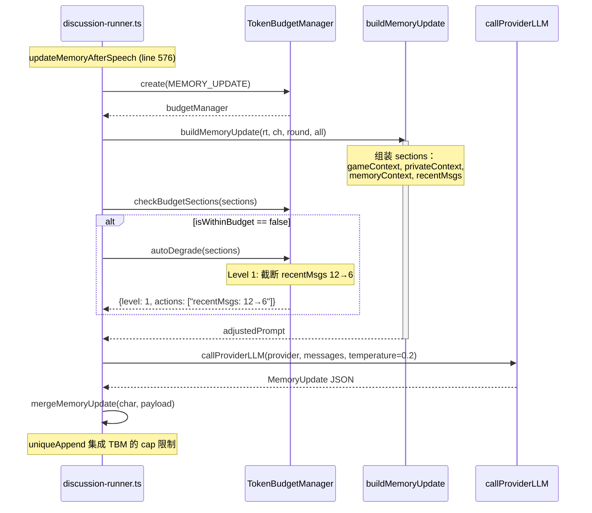
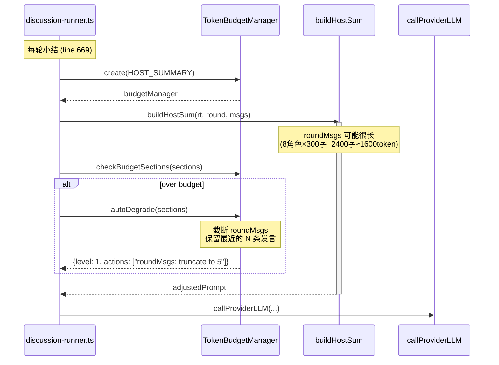
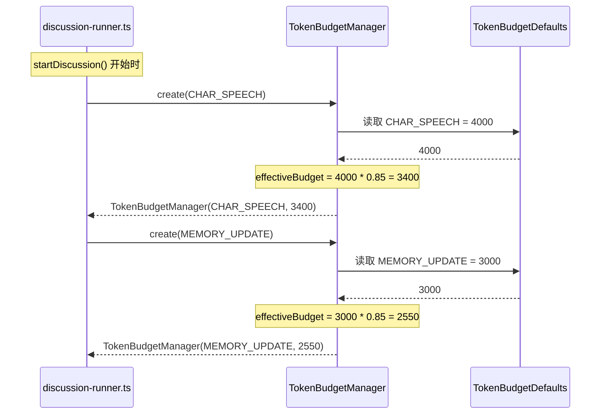

# AI 圆桌（AI RoundTable）— 统一 Token 上下文管理方案

> 设计者：Bob（Architect）  
> 日期：2025-07-17  
> 版本：v1.0

---

## 目录

1. [实现方案 + 框架选型](#1-实现方案--框架选型)
2. [文件清单](#2-文件清单)
3. [数据结构和接口（类图）](#3-数据结构和接口类图)
4. [程序调用流程（时序图）](#4-程序调用流程时序图)
5. [任务列表](#5-任务列表)
6. [依赖包列表](#6-依赖包列表)
7. [共享知识](#7-共享知识)
8. [待明确事项](#8-待明确事项)

---

## 1. 实现方案 + 框架选型

### 1.1 核心技术挑战

| 挑战 | 说明 |
|------|------|
| **无统一预算管理** | buildCharSpeech / buildMemoryUpdate / buildHostSum 各自独立组装 Prompt，没有共享的 Token 预算检查 |
| **消息按条数截断而非按 Token** | `buildRecentMsgs(msgs, 6)` 固定取 6 条，但单条内容可能长达 2000+ token（如长讨论场景） |
| **记忆无限累积** | `uniqueAppend` 虽然限制了数组长度（cap=40），但不检查单条内容的 token 大小；`cleanShortList` 截断字符是 80，但未按 token 评估 |
| **没有 Token 估算** | 发包前不检查 Prompt 总长度，LLM 调用 `max_tokens=1024` 硬编码，可能导致 context window 爆掉 |
| **不同角色共享同一种预算策略** | 角色发言（需包含记忆 + 近期消息）、记忆更新（只需少量消息）、主持人总结（需整轮消息）三者需要的上下文预算差异很大，但没有差异化策略 |

### 1.2 框架选型决策

| 选项 | 决策 | 理由 |
|------|------|------|
| **引入第三方 tokenizer** | **❌ 不引入** | 主流 LLM（GPT-4, Claude, Gemini）的 tokenizer 各不相同，引入一个就偏袒一个厂商。本项目是通用框架，不应绑定某一厂商的计费方式 |
| **字符比例估算** | **✅ 采用** | 中英文混合场景中，一个 token ≈ 1.5~2 个汉字（中文）或 ~4 个字符（英文）。保守估算：**1 token = 1.5 汉字**（中文为主场景），**1 token = 3 字符**（通用场景）。虽不精确，但足够做预算检查和降级触发 |
| **使用 tiktoken（可选扩展）** | **预留接口** | 如果后期需要精确计数，可以在 `TokenEstimator` 接口下加一个 `TikTokenEstimator` 实现，不改变上层逻辑 |

### 1.3 Token 估算策略

采用 **保守估算 + 安全余量** 策略：

```
// 中文为主的场景（本项目默认）
estimatedTokens = text.length / 1.5

// 通用场景（fallback）
estimatedTokens = text.length / 3

// 安全余量：在触发降级前保留 15% buffer
effectiveLimit = budgetLimit * 0.85
```

### 1.4 超限降级策略（三级降级）

按优先级从低到高（先尝试代价最小的）：

```
Level 0: 正常组装（不做额外处理）
Level 1: 截断近期消息（buildRecentMsgs）
  - 从 limit=6 逐步降低到 limit=3 → 2 → 1
  - 逐步丢弃最早的消息，保留最近的消息
Level 2: 压缩记忆（buildMemoryContext）
  - privateMemory: 保留最近的 N 条（cap 从 40 → 20 → 10）
  - publicMemory: 同上
  - 策略描述（strategyPlan）截断到 100 字
Level 3: 摘要替换历史（未来扩展）
  - 对超出预算的消息做一次 LLM 摘要，用摘要文本替代原始消息
  - 此级别会消耗额外 LLM 调用，仅在极端场景启用
  - MVP 阶段只做到 Level 2
```

### 1.5 统一 TokenBudgetManager 设计

```
┌─────────────────────────────────────────────────────┐
│                  TokenBudgetManager                  │
├─────────────────────────────────────────────────────┤
│  模型级别默认预算 + 角色类型差异化分配               │
│                                                      │
│  一次 create() → 多次 check() → 触发 autoDegrade()  │
│                                                      │
│  降级是作用域内的（scope-aware）：                    │
│  - 角色发言：按 speech budget 检查                   │
│  - 记忆更新：按 memory-update budget 检查            │
│  - 主持人总结：按 host-summary budget 检查           │
└─────────────────────────────────────────────────────┘
```

### 1.6 不同角色上下文的预算分配规则

| Prompt 类型 | 默认预算 (token) | 预算构成 | 降级优先级 |
|-------------|------------------|----------|------------|
| **角色发言** buildCharSpeech | 4000 | persona(200) + gameContext(400) + memory(800) + recentMsgs(2000) + instructions(200) + whisper(400) | ① 截断 recentMsgs ② 压缩 memory |
| **记忆更新** buildMemoryUpdate | 3000 | persona(200) + gameContext(400) + memory(800) + recentMsgs(1400) + instructions(200) | ① 截断 recentMsgs ② 压缩 memory |
| **主持人开场** buildHostOpen | 4000 | persona(200) + scenario(300) + rules(200) + goal(100) + charList(2000) + judgeCtx(800) + instructions(400) | ① 压缩 charList（按需） |
| **主持人小结** buildHostSum | 4000 | role(100) + goal(100) + judgeCtx(800) + roundMsgs(2500) + instructions(500) | ① 截断 roundMsgs |
| **主持人终总结** buildHostFinal | 6000 | role(100) + scenario(300) + charSummary(200) + judgeCtx(800) + allRecords(4000) + instructions(600) | ① 截断 allRecords |
| **结构化结果** buildResultPrompt | 4000 | goal(200) + judgeCtx(800) + allRecords(2500) + instructions(500) | ① 截断 allRecords |

---

## 2. 文件清单

### 2.1 新建文件

| # | 相对路径 | 说明 |
|---|---------|------|
| 1 | `src/lib/token-manager.ts` | TokenBudgetManager 主类 + TokenEstimator 工具函数 + 类型定义 |
| 2 | `src/lib/token-manager.test.ts` | 单元测试（可选，按项目测试策略决定） |

### 2.2 修改文件

| # | 相对路径 | 改动范围 |
|---|---------|---------|
| 3 | `electron/discussion-runner.ts` | ① buildRecentMsgs → 接受 budget 参数做 token 感知截断 ② buildMemoryContext → 接受 budget 参数做记忆压缩 ③ buildCharSpeech / buildMemoryUpdate / buildHostSum / buildHostFinal / buildResultPrompt → 集成 TokenBudgetManager ④ updateMemoryAfterSpeech → 调用 budget-check |
| 4 | `src/lib/prompts.ts` | 同上，渲染进程侧的对应函数（buildRecentContext, buildMemoryContext, buildCharacterSpeechPrompt 等）做对应改造 |
| 5 | `electron/providers.ts` | `callProviderLLM` / `callProviderLLMStream` 的 `max_tokens` 参数改为从 TokenBudgetManager 动态获取，不再硬编码 1024 |

---

## 3. 数据结构和接口（类图）

### 3.1 classDiagram

```mermaid
classDiagram
    %% ===== Enums / Constants =====
    class TokenBudgetDefaults {
        <<constants>>
        +CHAR_SPEECH: number = 4000
        +MEMORY_UPDATE: number = 3000
        +HOST_OPENING: number = 4000
        +HOST_SUMMARY: number = 4000
        +HOST_FINAL: number = 6000
        +STRUCTURED_RESULT: number = 4000
        +SAFETY_MARGIN: number = 0.85
        +TOKEN_PER_CHAR_CN: number = 1.5
        +TOKEN_PER_CHAR_EN: number = 3
    }

    %% ===== Value Objects =====
    class TokenEstimateResult {
        +text: string
        +estimatedTokens: number
        +charLength: number
        +isOverBudget: boolean
    }

    class TruncationConfig {
        +recentMsgMaxCount: number    // 从 6 降级到 3→2→1
        +memoryPrivateCap: number     // 从 40 降级到 20→10
        +memoryPublicCap: number      // 从 40 降级到 20→10
        +strategyMaxChars: number     // 从 240 降级到 100
        +isSummarized: boolean        // Level 3 标记
    }

    class DegradeResult {
        +level: 0 | 1 | 2 | 3
        +actions: string[]           // 记录了哪些降级操作被执行
        +finalBudget: number         // 降级后的有效预算
    }

    %% ===== Core Service =====
    class TokenEstimator {
        +estimateTokens(text: string): number
        +estimateMessages(msgs: Message[]): TokenEstimateResult
        +estimateSections(sections: Record~string, string~): Record~string, TokenEstimateResult~
        +totalOf(results: TokenEstimateResult[]): number
    }

    class TokenBudgetManager {
        -estimator: TokenEstimator
        -promptType: PromptType
        -baseBudget: number
        -effectiveBudget: number
        -config: TruncationConfig
        +static create(promptType: PromptType, overrides?: Partial~Record~PromptType, number~~): TokenBudgetManager
        +checkBudget(text: string): boolean
        +checkBudgetSections(sections: Record~string, string~): BudgetCheckReport
        +autoDegrade(sections: Record~string, string~): DegradeResult
        +getConfig(): TruncationConfig
        +getEffectiveBudget(): number
    }

    class BudgetCheckReport {
        +isWithinBudget: boolean
        +totalEstimated: number
        +budgetLimit: number
        +sectionEstimates: Record~string, {text: string, estimated: number}~
        +overage: number
    }

    %% ===== Prompt Type Enum =====
    class PromptType {
        <<enum>>
        CHAR_SPEECH
        MEMORY_UPDATE
        HOST_OPENING
        HOST_SUMMARY
        HOST_FINAL
        STRUCTURED_RESULT
    }

    %% ===== Relationships =====
    TokenBudgetManager *-- TokenEstimator : uses
    TokenBudgetManager *-- TruncationConfig : manages
    TokenBudgetManager ..> BudgetCheckReport : produces
    TokenBudgetManager ..> DegradeResult : produces
    TokenEstimator ..> TokenEstimateResult : produces
    TokenBudgetDefaults ..> TokenBudgetManager : provides defaults
    PromptType ..> TokenBudgetManager : parameterizes
```

### 3.2 接口详解

#### TokenEstimator

```typescript
// src/lib/token-estimator.ts

export interface TokenEstimateResult {
  text: string;
  estimatedTokens: number;
  charLength: number;
  isOverBudget: boolean;
}

export class TokenEstimator {
  /** 估算单段文本的 token 数（中文为主场景） */
  static estimateTokens(text: string): number {
    // 中文字符权重 1.0，英文字符权重 0.33
    // estimated = cnChars / 1.5 + enChars / 3
    // 等价于 (cnChars * 2 + enChars) / 3
    let cnChars = 0;
    let enChars = 0;
    for (const ch of text) {
      if (/[\u4e00-\u9fff\u3400-\u4dbf]/.test(ch)) {
        cnChars++;
      } else if (ch.match(/\S/)) {
        enChars++;
      }
    }
    return Math.ceil((cnChars * 2 + enChars) / 3);
  }

  /** 批量估算一组消息 */
  static estimateMessages(msgs: Message[]): TokenEstimateResult[];

  /** 估算命名 sections 的 token */
  static estimateSections(sections: Record<string, string>): Record<string, TokenEstimateResult>;
}
```

#### TokenBudgetManager

```typescript
// src/lib/token-manager.ts

export enum PromptType {
  CHAR_SPEECH = 'CHAR_SPEECH',
  MEMORY_UPDATE = 'MEMORY_UPDATE',
  HOST_OPENING = 'HOST_OPENING',
  HOST_SUMMARY = 'HOST_SUMMARY',
  HOST_FINAL = 'HOST_FINAL',
  STRUCTURED_RESULT = 'STRUCTURED_RESULT',
}

export interface TruncationConfig {
  recentMsgMaxCount: number;   // default: 6
  memoryPrivateCap: number;    // default: 40
  memoryPublicCap: number;     // default: 40
  strategyMaxChars: number;    // default: 240
  isSummarized: boolean;       // default: false (Level 3)
}

export interface BudgetCheckReport {
  isWithinBudget: boolean;
  totalEstimated: number;
  budgetLimit: number;
  sectionEstimates: Record<string, { text: string; estimated: number }>;
  overage: number;
}

export interface DegradeResult {
  level: 0 | 1 | 2 | 3;
  actions: string[];
  finalBudget: number;
}

export class TokenBudgetManager {
  private readonly estimator: TokenEstimator;
  private readonly promptType: PromptType;
  private readonly baseBudget: number;
  private effectiveBudget: number;
  private config: TruncationConfig;

  static create(
    promptType: PromptType,
    overrides?: Partial<Record<PromptType, number>>
  ): TokenBudgetManager;

  checkBudget(text: string): boolean;
  checkBudgetSections(sections: Record<string, string>): BudgetCheckReport;

  /**
   * 自动降级：检查各 section，按需截断
   * 返回降级后的配置和操作记录
   */
  autoDegrade(sections: Record<string, string>): DegradeResult;

  getConfig(): TruncationConfig;
  getEffectiveBudget(): number;
}
```

---

## 4. 程序调用流程（时序图）

### 4.1 角色发言前完整流程



### 4.2 记忆更新流程



### 4.3 主持人小结流程



### 4.4 初始化 TokenBudgetManager 流程



---

## 5. 任务列表

### 5.1 任务依赖与顺序

| Task ID | 任务名称 | 源文件 | 依赖 | 优先级 |
|---------|---------|--------|------|--------|
| T01 | **项目基础设施 + TokenEstimator** | 新建 `src/lib/token-estimator.ts`，新建 `src/lib/token-manager.ts`（类型定义部分） | 无 | P0 |
| T02 | **TokenBudgetManager 核心逻辑** | 完成 `src/lib/token-manager.ts`（TokenBudgetManager 类 + TruncationConfig + DegradeResult + PromptType 枚举 + BudgetCheckReport） | T01 | P0 |
| T03 | **集成到 discussion-runner.ts（主进程）** | 修改 `electron/discussion-runner.ts`：buildRecentMsgs / buildMemoryContext / buildCharSpeech / buildMemoryUpdate / buildHostSum / buildHostFinal / buildResultPrompt 集成 TBM | T02 | P0 |
| T04 | **集成到 prompts.ts（渲染进程）** | 修改 `src/lib/prompts.ts`：buildRecentContext / buildMemoryContext / buildCharacterSpeechPrompt / buildMemoryUpdatePrompt 集成 TBM | T02 | P1 |
| T05 | **集成到 providers.ts + 边界处理** | 修改 `electron/providers.ts`：动态 max_tokens；全局异常保护（降级失败 fallback、日志） | T03 | P1 |

### 5.2 任务详细描述

#### T01: 项目基础设施 + TokenEstimator

**文件**：
- 新建 `src/lib/token-estimator.ts`
- 新建 `src/lib/token-manager.ts`（仅类型定义和常量部分）

**改动内容**：

`src/lib/token-estimator.ts`：
```
- TokenEstimateResult 接口
- TokenEstimator 类（静态方法）
  - estimateTokens(text): number — 核心估算逻辑，见 3.2 节
  - estimateMessages(msgs): TokenEstimateResult[]
  - estimateSections(sections): Record<string, TokenEstimateResult>
```

`src/lib/token-manager.ts`（类型部分）：
```
- PromptType 枚举
- TokenBudgetDefaults 常量对象
- TruncationConfig 接口
- BudgetCheckReport 接口
- DegradeResult 接口
```

**预期影响**：纯新增，不修改任何现有行为。可以在 T01 完成后单独测试估算精度。

---

#### T02: TokenBudgetManager 核心逻辑

**文件**：
- 完成 `src/lib/token-manager.ts`（类实现部分）

**改动内容**：
```
- TokenBudgetManager 类
  - static create(promptType, overrides?) — 工厂方法，加载默认预算 + 可选覆盖
  - checkBudget(text): boolean — 单段检查
  - checkBudgetSections(sections): BudgetCheckReport — 多段联合检查
  - autoDegrade(sections): DegradeResult — 自动降级逻辑
    - 先 Level 1: 降低 recentMsgMaxCount (6→3→2→1)
    - 再 Level 2: 降低 memory caps (40→20→10) + strategyMaxChars (240→100)
    - 再 Level 3: 标记 isSummarized = true
    - 每次降级后重新检查，直到达标或降无可降
  - getConfig(): TruncationConfig — 获取当前配置
  - getEffectiveBudget(): number — 获取有效预算
```

**预期影响**：纯新增，不修改任何现有代码。可在 T02 完成后编写单元测试验证降级逻辑。

---

#### T03: 集成到 discussion-runner.ts（主进程）

**文件**：
- 修改 `electron/discussion-runner.ts`

**改动内容**：

1. **导入 TokenBudgetManager + TokenEstimator**
2. **修改 `buildRecentMsgs(msgs, limit?)`** — 增加 budget 参数重载：
   ```typescript
   function buildRecentMsgs(msgs: InlineMessage[], limit?: number, maxTokens?: number): string
   ```
   当传入了 maxTokens 时，在 slice(-limit) 之后逐步丢弃最早消息直到估计 token 数 ≤ maxTokens。

3. **修改 `buildMemoryContext(c, config?)`** — 增加 TruncationConfig 参数：
   ```typescript
   function buildMemoryContext(c: InlineCharacter, config?: TruncationConfig): string
   ```
   当传入了 config 时，用 config.memoryPrivateCap / memoryPublicCap / strategyMaxChars 替代硬编码值。

4. **修改 `buildCharSpeech`** — 在组装前创建 TokenBudgetManager，检查预算，触发 autoDegrade，用降级后的配置调用子函数：
   ```typescript
   function buildCharSpeech(rt, c, round, msgs, hf?): string {
     const tbm = TokenBudgetManager.create(PromptType.CHAR_SPEECH);
     // ... 组装 sections ...
     const report = tbm.checkBudgetSections(sections);
     if (!report.isWithinBudget) {
       const degrade = tbm.autoDegrade(sections);
       // 用 degrade 后的 config 重新组装
     }
     // ... 继续组装 ...
   }
   ```

5. **修改 `buildMemoryUpdate`** — 同上，使用 `MEMORY_UPDATE` 预算

6. **修改 `buildHostSum` / `buildHostFinal` / `buildResultPrompt`** — 使用对应的预算类型

7. **修改 `updateMemoryAfterSpeech`** — 在调用 buildMemoryUpdate 前创建 TBM，确保记忆更新 prompt 本身不会超限

**预期影响**：这是核心改动。所有 prompt builder 函数都会集成预算检查。由于保持向后兼容（不传 budget 参数时行为不变），风险可控。

---

#### T04: 集成到 prompts.ts（渲染进程）

**文件**：
- 修改 `src/lib/prompts.ts`

**改动内容**：
与 T03 的 `discussion-runner.ts` 改动完全对应，但作用于渲染进程版本的 prompt builder：
- `buildRecentContext(msgs, limit?, maxTokens?)`
- `buildMemoryContext(character, config?)`
- `buildCharacterSpeechPrompt(...)` — 集成 TBM
- `buildMemoryUpdatePrompt(...)` — 集成 TBM
- `buildHostSummaryPrompt(...)` — 集成 TBM
- `buildHostFinalSummaryPrompt(...)` — 集成 TBM
- `buildStructuredResultPrompt(...)` — 集成 TBM

**预期影响**：渲染进程的 prompt builder 获得同样的预算保护。由于渲染进程主要用于 retry/重放场景，优先级低于主进程。

---

#### T05: 集成到 providers.ts + 边界处理

**文件**：
- 修改 `electron/providers.ts`
- 修改 `electron/discussion-runner.ts`（边界保护）

**改动内容**：

1. **`providers.ts` — 动态 max_tokens**：
   ```typescript
   // 原: max_tokens: 1024
   // 改为:
   max_tokens: Math.min(
     remainingBudget ?? 1024,  // 如果传入了剩余预算，取 min
     4096                      // 同时受限于模型最大输出
   )
   ```
   `callProviderLLM` 和 `callProviderLLMStream` 的可选参数增加 `remainingBudget?: number`。

2. **`discussion-runner.ts` — 全局异常保护**：
   - 在 `callLlm` 调用前增加最后一道防线：如果 prompt 的 estimated token 超过某个硬上限（如 8000），强制截断并记日志
   - 降级失败时的 fallback：如果 autoDegrade 后仍然超限，强制将 recentMsgs 降为 1 条、memory 清空为 `[]`，确保不会发送超长 prompt

3. **日志/调试信息**：
   - 在降级时输出 warn 级别日志：`[TokenBudget] CHAR_SPEECH degraded to level 1: reduced recentMsgs 6→3`
   - 极端降级（level 3）时输出 error 级别日志

**预期影响**：提供最后一道防线，确保即使降级逻辑有 bug，也不会发送超过模型 context window 的 prompt。

---

## 6. 依赖包列表

### 6.1 新增依赖

| 包名 | 版本 | 用途 | 必要性 |
|------|------|------|--------|
| 无 | - | 本项目采用字符比例估算，不引入第三方 tokenizer | - |

### 6.2 可选依赖（预留接口）

| 包名 | 版本 | 用途 | 说明 |
|------|------|------|------|
| `tiktoken` | ^1.0.0 | OpenAI 精确 token 计数 | 仅当需要 GPT 系列精确计数时引入。通过 `TokenEstimator` 接口扩展 |

### 6.3 当前已有相关依赖

| 包名 | 版本 | 用途 |
|------|------|------|
| `electron-store` | ^8.x | 持久化存储（provider 配置等） |
| 无 | - | 项目当前无 tokenizer 相关依赖 |

---

## 7. 共享知识

### 7.1 跨文件常量

```typescript
// src/lib/token-manager.ts

/** 各类 prompt 的默认 token 预算 */
export const TOKEN_BUDGET_DEFAULTS = {
  CHAR_SPEECH: 4000,
  MEMORY_UPDATE: 3000,
  HOST_OPENING: 4000,
  HOST_SUMMARY: 4000,
  HOST_FINAL: 6000,
  STRUCTURED_RESULT: 4000,
} as const;

/** 安全余量系数 — 在触发降级前保留的 buffer */
export const SAFETY_MARGIN = 0.85;

/** Token 换算系数 */
export const TOKEN_PER_CN_CHAR = 1.5;    // 1 token ≈ 1.5 汉字
export const TOKEN_PER_EN_CHAR = 3;      // 1 token ≈ 3 英文字符

/** 降级步进配置 */
export const DEGRADE_STEPS = {
  recentMsgMaxCount: [6, 3, 2, 1],
  memoryCap: [40, 20, 10],
  strategyMaxChars: [240, 100],
} as const;
```

### 7.2 跨文件约定

1. **所有 prompt builder 函数**保持签名兼容：新增参数均为可选，不传时行为与改造前一致。
2. **所有估算单位**统一为 token（非字符），调用方只需比较 `estimatedTokens <= budgetLimit * SAFETY_MARGIN`。
3. **降级操作记录**以 `string[]` 形式传递，便于调试和日志输出。
4. **LLM 输出 `max_tokens`** 不再硬编码，而是由调用方传入剩余预算。
5. **异常安全**：TokenBudgetManager 的所有方法不应抛出异常。如果估算或降级过程中出现意外，静默返回当前配置（不降级）并记 warn 日志。

### 7.3 调用约定

```
// 所有 prompt builder 的 budget 参数约定：
// - 不传或 undefined：使用默认 limit（改造前行为）
// - 传 TruncationConfig：使用指定的限制
//
// TokenBudgetManager 的使用约定：
// - 创建：在每次需要组装 prompt 时创建新实例（不共享）
// - 检查：checkBudgetSections → 返回报告
// - 降级：autoDegrade → 返回 actions + 新 config
// - 组装：用降级后的 config 重新调用 builder 子函数
```

---

## 8. 待明确事项

### 8.1 需产品/团队决策

| # | 事项 | 建议方案 | 需要决策 |
|---|------|---------|---------|
| 1 | **降级时是否通知用户？** | 目前建议静默降级（只记日志），避免频繁打断用户体验。但如果用户开启了"调试模式"，可以通过 IPC 发送降级事件 | 是否需要在 UI 上展示 token 用量或降级提示？ |
| 2 | **是否需要精确 token 计数？** | MVP 阶段字符比例估算足够。但如果有用户投诉上下文丢失，可以考虑引入 tiktoken 作为精确 fallback | 是否需要预留 tiktoken 集成的工作量？ |
| 3 | **预算默认值是否可配置？** | 目前为硬编码常量。如果需用户自定义，可在 RoundTable 的 rules 或 runtimeControl 中添加 `tokenBudgetOverrides?: Partial<Record<PromptType, number>>` | 是否需要在 UI 中添加预算配置入口？ |
| 4 | **Level 3（摘要替换）是否 MVP 需要？** | 建议 MVP 不做。摘要需要额外 LLM 调用，成本高、延迟大 | 是否要加入 Roadmap V2？ |

### 8.2 技术待验证

| # | 事项 | 说明 |
|---|------|------|
| 5 | **字符比例估算的准确性** | 需要在 GPT-4 / Claude 3 等主流模型上做实际验证。建议 T01 完成后用真实讨论数据跑一批测试，统计"估算值 vs 实际 API 返回的 usage" 的偏差 |
| 6 | **降级后对讨论质量的影响** | 截断消息和压缩记忆后，角色发言质量是否会显著下降？需要 A/B 测试验证 |

### 8.3 假设

- 本项目以中文讨论为主，所以 `TOKEN_PER_CN_CHAR = 1.5` 作为主估算系数
- 假设 LLM 模型的最小 context window 为 8K（GPT-3.5 级别），所以最大预算不超过 6000（保留 2K 给输出）
- `uniqueAppend` 的 cap=40 保持不变，仅当 Level 2 降级时降低为 20→10
