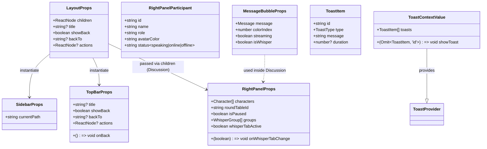
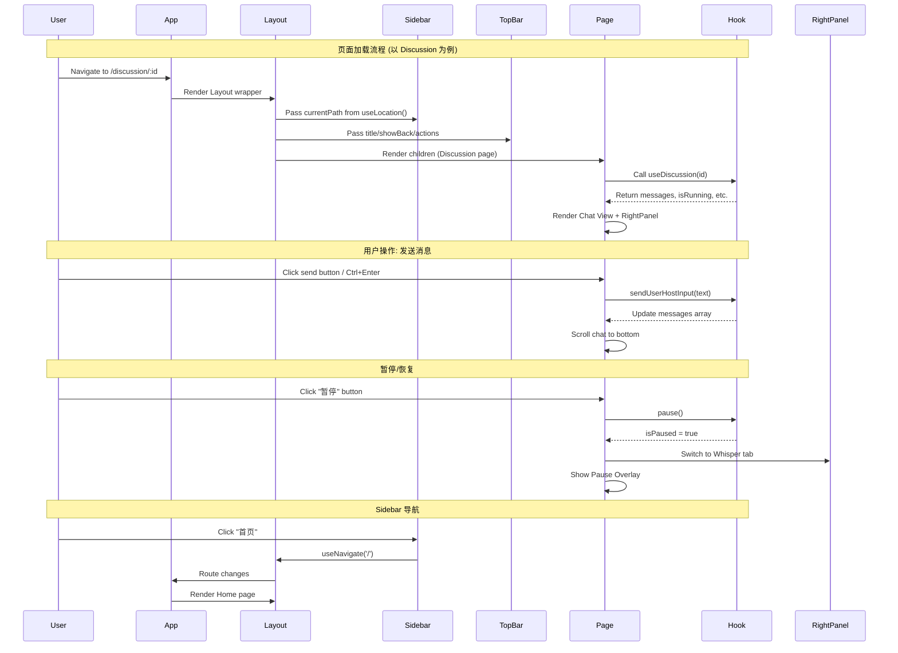

# UI 重新设计 — 系统架构设计与任务分解

> **项目**: MultiRound (AI 圆桌模拟器) — React + Electron  
> **设计稿**: `ai-roundtable-desktop-complete.html` (深色紫渐变主题, 1177 行)  
> **PRD**: `docs/ui-redesign-prd.md`  
> **建筑师**: Bob  
> **日期**: 2026-07

---

## Part A: 系统设计

---

### 1. 实现方案

#### 1.1 核心难点分析

| 难点 | 说明 | 解决方案 |
|------|------|----------|
| **从 CSS class 迁移到 Tailwind token** | 设计稿使用原生 CSS 变量（`--p50`, `--g200` 等），React 项目使用 Tailwind CSS 4（`@tailwindcss/vite`），需要将 ~30 个设计 token 映射为 Tailwind `@theme` 定义 | 在 `index.css` 中用 `@theme` 块定义全部颜色、间距、圆角、阴影 token，直接替换现有 CSS 变量 |
| **Layout 结构重写** | 当前 Layout 仅含 header + children 的简单结构；设计稿为 Sidebar(240px) + Main Content(TopBar + Content Area) | 重写 `Layout.tsx` 为含 Sidebar 和 TopBar 的完整布局，原有 `showBack`/`backTo`/`actions`/`title` props 保留并接入 TopBar |
| **Discussion 三栏→双栏** | 当前三栏（char list + feed + info/whisper），设计稿转为 Layout(Sidebar) + TopBar + Content Area(Chat View + Right Panel 260px) | Left char list → 迁入 Right Panel 的"参与者"Tab；Right sidebar info → 迁入 Right Panel；WhisperPanel 嵌入 Right Panel 的"私密消息"Tab |
| **Sidebar 导航与路由同步** | 需要根据 React Router 当前路径高亮对应导航项 | 使用 `useLocation()` 在 Sidebar 中动态匹配路径，生成 `active` class |
| **深度模式页面暂不实现** | 设计稿包含 dp-overlay（辩论赛/剧本杀/知识竞赛等） | Sidebar 中"深度模式"区域暂时隐藏或保留为灰色禁用状态，等后续功能开发时启用 |

#### 1.2 架构模式

```
┌────────────────────────────────────────────────────┐
│                  HashRouter                         │
│  ┌──────────────────────────────────────────────┐  │
│  │              Layout (w/ Sidebar)              │  │
│  │  ┌───────┐  ┌─────────────────────────────┐  │  │
│  │  │       │  │  TopBar (56px)              │  │  │
│  │  │       │  ├─────────────────────────────┤  │  │
│  │  │Sidebar│  │  Content Area (children)    │  │  │
│  │  │ 240px │  │                             │  │  │
│  │  │       │  │                             │  │  │
│  │  │       │  │                             │  │  │
│  │  └───────┘  └─────────────────────────────┘  │  │
│  └──────────────────────────────────────────────┘  │
└────────────────────────────────────────────────────┘
```

- **布局模式**: Sidebar + TopBar + Content 三明治结构（全局唯一 Layout）
- **组件架构**: 容器组件（Pages）通过 hooks 获取数据，展示组件（Components）接收 props 渲染
- **样式架构**: 全部使用 Tailwind `@theme` token + 原子类名，零内联 style
- **路由**: HashRouter 不变，所有页面用 `<Layout><Page /></Layout>` 包裹

#### 1.3 设计稿 CSS → Tailwind @theme 映射表

| 设计稿 Token | CSS 变量 | 值 | Tailwind 用法 | 说明 |
|---|---|---|---|---|
| Primary 50 | `--p50` | `#f5f3ff` | `bg-p50 text-p50` | 浅紫背景 |
| Primary 100 | `--p100` | `#ede9fe` | `bg-p100 text-p100 border-p100` | 浅紫标签/边框 |
| Primary 200 | `--p200` | `#ddd6fe` | `border-p200` | 浅紫边框 |
| Primary 400 | `--p400` | `#a78bfa` | `text-p400 border-p400` | 次要紫 |
| Primary 500 | `--p500` | `#8b5cf6` | `ring-p500 focus:ring-p500` | focus ring |
| Primary 600 | `--p600` | `#7c3aed` | `bg-p600 hover:bg-p700` | 主色按钮 |
| Primary 700 | `--p700` | `#6d28d9` | `text-p700 hover:bg-p700` | Hover/深紫文字 |
| Primary 900 | `--p900` | `#4c1d95` | — | Sidebar 渐变顶部 |
| Gray 50 | `--g50` | `#f9fafb` | `bg-g50` | 页面背景 |
| Gray 100 | `--g100` | `#f3f4f6` | `bg-g100 hover:bg-g100` | 浅灰悬停 |
| Gray 200 | `--g200` | `#e5e7eb` | `border-g200` | 边框/分割线 |
| Gray 300 | `--g300` | `#d1d5db` | `text-g300` | 浅灰文本/滚动条 |
| Gray 400 | `--g400` | `#9ca3af` | `text-g400` | 次要文字 |
| Gray 500 | `--g500` | `#6b7280` | `text-g500` | 正文次级 |
| Gray 600 | `--g600` | `#4b5563` | `text-g600` | 正文文字 |
| Gray 700 | `--g700` | `#374151` | `text-g700` | 强调文字 |
| Gray 800 | `--g800` | `#1f2937` | `text-g800` | 深色文字 |
| Gray 900 | `--g900` | `#111827` | `text-g900` | 标题文字 |
| Success | `--success` | `#10b981` | `bg-success text-success` | 成功/进行中 |
| Warning | `--warning` | `#f59e0b` | `bg-warning` | 警告 |
| Error | `--error` | `#ef4444` | `bg-error text-error` | 错误/停止 |
| Info | `--info` | `#3b82f6` | `bg-info text-info` | 信息 |

> **注意**: Tailwind v4 使用 `@theme` 指令时，`--color-*` 前缀自动生成 `bg-*/text-*/border-*` 等工具类。例如 `--color-p50: #f5f3ff` 生成 `bg-p50 text-p50 border-p50`。间距同理: `--spacing-s1: 4px` 生成 `p-s1 m-s1 gap-s1` 等。

---

### 2. 文件列表

所有路径相对于项目根目录 `E:\ai\multiround\`。

#### P0 — 基础框架

| # | 文件路径 | 操作 | 说明 |
|---|---|---|---|
| 1 | `src/index.css` | **重写** | 替换为 `@theme` 定义 + 保留动画 |
| 2 | `src/components/Layout.tsx` | **重写** | 新增 Sidebar + TopBar 完整布局 |
| 3 | `src/components/Sidebar.tsx` | **新增** | 左侧导航组件(240px, 深紫渐变) |
| 4 | `src/components/TopBar.tsx` | **新增** | 顶部栏组件(56px, 标题+操作按钮) |

#### P0 — 核心讨论页

| # | 文件路径 | 操作 | 说明 |
|---|---|---|---|
| 5 | `src/pages/Discussion.tsx` | **重写布局** | 三栏→双栏(Chat View + Right Panel) |
| 6 | `src/components/MessageBubble.tsx` | **重写样式** | 设计稿气泡样式(host/role/whisper) |
| 7 | `src/components/RightPanel.tsx` | **新增** | 右侧面板(参与者Tab + 私密消息Tab) |

#### P1 — 其他页面

| # | 文件路径 | 操作 | 说明 |
|---|---|---|---|
| 8 | `src/pages/Home.tsx` | **样式更新** | Hero/Feature Cards/History 使用设计系统 token |
| 9 | `src/pages/Create.tsx` | **样式更新** | 卡片/表单/表格/固定底栏使用设计系统 token |
| 10 | `src/pages/Result.tsx` | **样式更新** | 主题卡/角色摘要/轮次/总结使用设计系统 token |
| 11 | `src/pages/Settings.tsx` | **样式更新** | 设置卡片/输入框/开关使用设计系统 token |

#### P1 — 子组件样式微调

| # | 文件路径 | 操作 | 说明 |
|---|---|---|---|
| 12 | `src/components/WhisperPanel.tsx` | **样式微调** | Tab 样式一致化 |
| 13 | `src/components/RoundIndicator.tsx` | **样式微调** | 进度条/数字圈使用 p500/p100 |
| 14 | `src/components/OneOnOneTab.tsx` | **样式微调** | 联系人列表/消息气泡使用设计系统 |
| 15 | `src/components/GroupTab.tsx` | **样式微调** | 群组列表/消息气泡一致化 |
| 16 | `src/components/CreateGroupDialog.tsx` | **样式微调** | Modal 使用 interject-modal 风格 |

#### P2 — 润色

| # | 文件路径 | 操作 | 说明 |
|---|---|---|---|
| 17 | `src/components/Toast.tsx` | **样式微调** | Shadow/spacing 微调 |
| 18 | `src/components/ErrorBoundary.tsx` | **样式微调** | 按钮使用 bg-p600 |
| 19 | `src/components/CharacterForm.tsx` | **样式微调** | 统一 token（未使用则跳过） |

**不被修改的目录**:
- `src/hooks/` — useDiscussion, useWhisper 等
- `src/lib/` — storage, settings-store, types 等
- `src/types/` — 类型定义
- `src/App.tsx` — 路由结构（HashRouter + Routes 不变）
- `src/main.tsx` — 入口不变（ErrorBoundary + ToastProvider 包裹）

---

### 3. 数据结构和接口



**组件层级关系**:

```
App (HashRouter)
├── Layout (wraps all pages)
│   ├── Sidebar
│   │   ├── sb-logo (logo + brand name)
│   │   ├── nav section (主菜单)
│   │   │   ├── NavItem: 首页 (→ /)
│   │   │   ├── NavItem: 创建圆桌 (→ /create)
│   │   │   └── NavItem: 设置 (→ /settings)
│   │   ├── nav section (深度模式 — 暂隐藏)
│   │   └── sb-bottom (user info)
│   ├── TopBar
│   │   ├── back button (optional)
│   │   ├── title (optional)
│   │   ├── badge (optional)
│   │   └── actions (optional)
│   └── children (page content)
│
├── Discussion (page)
│   └── Content Area (flex)
│       ├── Chat View (flex:1)
│       │   ├── Chat Header (title + participants avatars)
│       │   ├── Host Bar (mode selector)
│       │   ├── Chat Messages (scrollable feed)
│       │   │   └── MessageBubble[] (host/role/whisper)
│       │   ├── Chat Input (textarea + send)
│       │   ├── Pause Overlay (conditional)
│       │   └── Stopped Overlay (conditional)
│       └── RightPanel (260px)
│           ├── rp-tabs (参与者 | 私密消息)
│           ├── Participants Tab
│           │   └── rp-participant[] (avatar + name + role + status)
│           └── Whisper Tab
│               └── WhisperPanel (1:1 + Group tabs)
│
├── Home (page)
│   ├── Hero section
│   ├── Feature Cards
│   ├── In-progress sessions bar
│   └── History list with search
│
├── Create (page)
│   ├── Scenario section (card)
│   ├── Host section (card)
│   ├── Teams section (card, optional)
│   ├── Characters table (card)
│   ├── Rules section (card)
│   ├── Goal section (card)
│   └── Fixed bottom submit bar
│
├── Result (page)
│   ├── Topic card (gradient)
│   ├── Character summary grid
│   ├── Round-by-round transcript
│   └── Final summary section
│
└── Settings (page)
    ├── Add Provider form (card)
    ├── Provider list (cards)
    ├── Usage guide (card)
    └── Data directory (card)
```

---

### 4. 程序调用流程



---

### 5. 不清楚/假设的事项

1. **深度模式导航项** — 设计稿 Sidebar 含"辩论赛/剧本杀/自由讨论/知识竞赛/最新动态"5 个深度模式导航，当前项目无对应路由。**方案**: 在 Sidebar 中保留"深度模式"区域但隐藏（注释掉），后续实现时再启用。

2. **TopBar 中是否保留 Electron 拖拽区域** — 当前 Layout header 有 `select-none`（拖拽区域）。**方案**: TopBar 保留 `select-none` 兼容 Electron。

3. **Result 页面的 `continueFromRound` 导航路径错误** — 当前代码中 `navigate('/discuss/${newId}')` 路径拼写错误（应为 `/discussion/:id`）。**方案**: 保持不动（属于 bug 修复，不在 UI 改造范围内），仅更新样式。

4. **CharacterForm 组件使用情况** — 该组件存在但 Create 页面使用的是内联 table 表单，未复用此组件。**方案**: 不做主要改造，仅统一 token（或跳过）。

5. **Toast 容器 z-index** — 当前 Toast 固定在 `top-4 right-4 z-50`。设计稿中有 interject modal（z-index: 200）。**方案**: 保持现有 Toast z-index 策略不变。

6. **RightPanel 是否提取为独立组件** — PRD 建议可选。考虑到 Discussion.tsx 已经 460 行，提取为 `RightPanel.tsx` 组件可以使代码更清晰。

7. **`lucide-react` 图标库** — 项目当前使用 lucide-react 图标，设计稿使用 Unicode 字符。**方案**: 继续使用 lucide-react 图标（与设计稿视觉效果一致，且是现成的 React 组件），不替换为字符。

---

## Part B: 任务分解

---

### 6. 所需依赖包

项目已安装（无需新增）:

```
- react@^18.x + react-dom@^18.x: UI 框架
- react-router-dom@^6.x: HashRouter 路由
- lucide-react@^0.x: 图标库 (Play, Pause, Users, Search 等)
- tailwindcss@^4.x + @tailwindcss/vite@^4.x: CSS 工具框架
- typescript@^5.x: 类型支持
```

**无需新增任何 npm 包**。所有 token 通过 Tailwind `@theme` 定义，无需额外 CSS-in-JS 方案。

---

### 7. 任务列表（有序，按依赖）

#### T01: 项目基础设施 — 设计 token 系统 + 全局样式 + 布局框架（P0）

**依赖**: 无（最先执行）

**文件** (4 个):
| 文件 | 操作 |
|------|------|
| `src/index.css` | **重写** — 用 `@theme` 定义全部设计 token |
| `src/components/Layout.tsx` | **重写** — 集成 Sidebar + TopBar |
| `src/components/Sidebar.tsx` | **新增** — 深紫渐变导航组件 |
| `src/components/TopBar.tsx` | **新增** — 顶部栏组件 |

**具体说明**:

1. **`src/index.css`**: 用 `@theme` 块替换现有 CSS 变量。包含:
   - 全部 8 个紫色 token (`--color-p50` ~ `--color-p900`)
   - 全部 9 个灰色 token (`--color-g50` ~ `--color-g900`)
   - 4 个语义色 (`--color-success/warning/error/info`)
   - 10 个间距 token (`--spacing-s1` ~ `--spacing-s12`)
   - 3 个圆角 token (`--radius-r/r-lg/r-xl`)
   - 4 个阴影 token (shadow-sm/md/lg/xl — Tailwind 已有，可注释映射)
   - 过渡 token (`--easing-default: 200ms ease`)
   - **保留** `slide-in-right` 动画和 `.animate-slide-in-right` class
   - 添加自定义滚动条样式（`::-webkit-scrollbar` 匹配设计稿的 4px 细滚动条）
   - 设置 body `font-family: 'Inter','Noto Sans SC',system-ui,sans-serif`
   - 设置 `#root` 全屏 flex 布局

2. **`src/components/Sidebar.tsx`**: 新组件，240px 固定宽度，深紫渐变背景。包含:
   - Logo 区域（菱形图标 + "AI 圆桌"）
   - 导航分组:"主菜单"（首页/创建圆桌/设置）
   - 导航分组:"深度模式"（暂隐藏，以后启用）
   - 底部用户信息（固定头像 + 名称 + 角色"主持人"）
   - 使用 `useLocation()` 根据当前路径设置 `active` class
   - 使用 `useNavigate()` 处理导航点击

3. **`src/components/TopBar.tsx`**: 新组件，56px 高度。包含:
   - 左侧: 返回按钮（可选）+ 标题 + badge（可选）
   - 右侧: actions（ReactNode，由页面传入）
   - 接收现有 Layout props: `title`, `showBack`, `backTo`, `actions`
   - `select-none` 保留 Electron 拖拽兼容

4. **`src/components/Layout.tsx`**: 重写为:
   - 外层 `flex h-screen w-full overflow-hidden`
   - 左侧 `<Sidebar />`
   - 右侧 `<div class="flex-1 flex flex-col overflow-hidden">` 包含 `<TopBar />` + `<main>{children}</main>`
   - 保留现有全部 props 接口 (`LayoutProps`)，转发给 TopBar
   - 删除旧的 header 实现

---

#### T02: 核心讨论页 — Discussion + MessageBubble + RightPanel（P0）

**依赖**: T01（需要新的 Layout/Sidebar/TopBar）

**文件** (3 个):
| 文件 | 操作 |
|------|------|
| `src/pages/Discussion.tsx` | **重写布局** — 三栏→双栏+RightPanel |
| `src/components/MessageBubble.tsx` | **重写样式** — 设计稿气泡 |
| `src/components/RightPanel.tsx` | **新增** — 右侧参与者/私信面板 |

**具体说明**:

1. **`src/pages/Discussion.tsx`**: 
   - 移除现有的 `<aside>` left sidebar（角色列表）和 right sidebar
   - 外层: `<Layout title={...} showBack backTo="/">`（Layout 自动提供 Sidebar + TopBar）
   - Content Area: `flex flex-1 overflow-hidden`
   - Left: Chat View `flex flex-col flex-1`
     - 顶部 Chat Header（标题 + 参与者头像叠加）
     - Host Bar（主持人模式选择，基于 `hostMode`）
     - Chat Messages（scrollable feed, `::-webkit-scrollbar` 4px 细滚动条）
     - Chat Input（设计稿的边框样式 + textarea + 发送按钮）
   - Right: `<RightPanel>` 组件
   - Pause Overlay 和 Stopped Overlay（设计稿的 backdrop-filter blur 样式）
   - **保留所有** hooks 调用: `useDiscussion`, `useEffect` scroll, toast 等
   - **保留所有** 状态变量: `whisperTabActive`, `error`, `failedCharacters` 等
   - **保留所有** 按钮事件: start/pause/resume/stop/retry/appendRound/sendUserHostInput

2. **`src/components/MessageBubble.tsx`**:
   - 保留 props 接口不变: `message`, `colorIndex`, `streaming`, `isWhisper`
   - 更新为设计稿的无工具栏纯气泡样式:
     - 主持人消息 (host) → 右侧排列，紫色渐变背景 `linear-gradient(135deg, #f5f3ff, #eef2ff)`，`border-p200`，`rounded-[12px]`，`border-top-right-radius: 4px`
     - 角色发言 (role) → 左侧排列，白色背景，`border-g200`，`border-top-left-radius: 4px`，`shadow-sm`
     - 私密消息 (whisper) → `border-2 border-dashed border-p400`，`bg-p50`
   - 添加 name 标签 (`.msg-name`) 和时间戳 (`.msg-time`)
   - 保留 streaming 打字光标效果（紫色脉冲光标）
   - 保留 `isWhisper` 的锁图标 prefix

3. **`src/components/RightPanel.tsx`**: 新组件，260px 固定宽度:
   - Tab 栏: "参与者" | "私密消息"（带红色未读圆点 badge）
   - Participants Tab: 主持人 + 角色列表，每个含圆形头像、名称、身份、状态指示器（speaking/online/offline）
   - Whisper Tab: 嵌入 `WhisperPanel` 组件
   - 接收 props: `characters`, `roundTableId`, `isPaused`, `groups`, `whisperTabActive`, `onWhisperTabChange`
   - 暂停时自动切换到 Whisper Tab（现有逻辑在 Discussion.tsx 的 useEffect 中，保持不动）

---

#### T03: 其他页面样式更新 — Home + Create + Result + Settings（P1）

**依赖**: T01（需要设计 token 系统）

**文件** (4 个):
| 文件 | 操作 |
|------|------|
| `src/pages/Home.tsx` | **样式更新** |
| `src/pages/Create.tsx` | **样式更新** |
| `src/pages/Result.tsx` | **样式更新** |
| `src/pages/Settings.tsx` | **样式更新** |

**具体说明**:

1. **`src/pages/Home.tsx`**:
   - 更新 Hero 区域: 保持 `bg-gradient-to-br from-p50 via-white to-indigo-50`
   - 更新 Feature Card: `bg-white rounded-2xl border border-g200 shadow-sm p-6`
   - 更新 First-run 提示: `bg-amber-50 border-amber-200 rounded-2xl`
   - 更新搜索框: `focus:ring-2 focus:ring-p500`
   - 更新历史记录卡片: `bg-white rounded-xl border border-g200 hover:border-p200`
   - 更新 action 按钮: `bg-p600 hover:bg-p700 rounded-lg`
   - **保留所有** 现有功能: 搜索、历史列表、删除/导出/重新运行
   - 移除自定义 header（由 Layout 统一提供）

2. **`src/pages/Create.tsx`**:
   - 更新所有 section 卡片: `bg-white rounded-2xl border border-g200 p-6`
   - 所有 input/select: `border-g300 focus:ring-2 focus:ring-p500 focus:border-p500 rounded-lg`
   - 所有 button: `bg-p600 hover:bg-p700 rounded-xl`
   - 固定底栏: `bg-white border-t border-g200`
   - 表格: `border-b border-g200` 表头 + `border-b border-g100` 行
   - Section 编号圆: `rounded-full bg-p600 text-white`
   - **保留所有** 现有表单逻辑和功能

3. **`src/pages/Result.tsx`**:
   - 主题卡片: `bg-gradient-to-r from-p600 to-indigo-600 rounded-2xl p-8 text-white`
   - 角色摘要卡片: `bg-g50 border border-g100 rounded-xl`
   - 轮次标题: `rounded-full bg-p100 text-p700`
   - 圆标数字: `w-8 h-8 bg-p100 text-p700 rounded-full`
   - 总结区域: `bg-gradient-to-r from-amber-50 to-orange-50 border border-amber-200 rounded-2xl`
   - 底部按钮: `bg-p600 hover:bg-p700 rounded-xl`
   - **保留所有** 现有功能: 复制全文、"从这里继续"、创建新圆桌

4. **`src/pages/Settings.tsx`**:
   - 更新厂商卡片: `bg-white rounded-2xl border border-g200 p-5 hover:border-p200`
   - 更新 input/select: `border-g300 focus:ring-2 focus:ring-p500 focus:border-p500 rounded-lg`
   - 更新 toggle 开关: 设计稿 `.stng-toggle` 样式（40x22 track + 18x18 thumb）
   - 更新预设按钮: `border-dashed border-g300 hover:border-p300`
   - 更新按钮: `bg-p600 hover:bg-p700 rounded-lg`
   - 使用说明卡片: `bg-indigo-50 border-indigo-200 rounded-2xl`
   - 数据目录卡片: `bg-white border border-g200 rounded-2xl`
   - **保留所有** 现有功能: 添加/测试/删除厂商、预设选择、显示 Key、数据目录

---

#### T04: 子组件样式微调 — WhisperPanel/RoundIndicator 等（P1）

**依赖**: T02（需要核心组件稳定）

**文件** (5 个):
| 文件 | 操作 |
|------|------|
| `src/components/WhisperPanel.tsx` | **样式微调** |
| `src/components/RoundIndicator.tsx` | **样式微调** |
| `src/components/OneOnOneTab.tsx` | **样式微调** |
| `src/components/GroupTab.tsx` | **样式微调** |
| `src/components/CreateGroupDialog.tsx` | **样式微调** |

**具体说明**:

1. **`WhisperPanel.tsx`**: Tab 按钮使用 `bg-p100 text-p700`（选中）vs `text-g500`（未选中），统一设计系统 token

2. **`RoundIndicator.tsx`**: 进度条颜色 `bg-p500`，数字圈 `bg-p100 text-p700`，圆角/间距使用设计 token

3. **`OneOnOneTab.tsx`**: 联系人列表使用 `hover:bg-g100`，选中状态 `bg-p50 border-l-p500`，消息气泡使用 `max-w-[80%] rounded-2xl` + 设计稿虚线边框风格

4. **`GroupTab.tsx`**: 群组列表/气泡统一使用设计 token，与 OneOnOneTab 风格一致

5. **`CreateGroupDialog.tsx`**: Modal 使用设计稿 `.interject-modal` 风格（`rounded-xl bg-white shadow-xl p-8`），按钮统一 `bg-p600 hover:bg-p700`

---

#### T05: 收尾润色 — Toast/ErrorBoundary 微调 + 一致性审查（P2）

**依赖**: T03, T04（所有样式稳定后）

**文件** (3 个):
| 文件 | 操作 |
|------|------|
| `src/components/Toast.tsx` | **样式微调** |
| `src/components/ErrorBoundary.tsx` | **样式微调** |
| `src/components/CharacterForm.tsx` | **确认/样式微调** |

**具体说明**:

1. **`Toast.tsx`**: 微调 shadow（`shadow-lg`）、间距（`gap-2`）、圆角（`rounded-xl`），颜色使用设计 token（`bg-green-50 border-green-200` 等不变，但这些颜色应与设计系统对齐）

2. **`ErrorBoundary.tsx`**: 将 "重试" 按钮 `bg-purple-600` → `bg-p600`，统一 token

3. **`CharacterForm.tsx`**: 确认是否被项目引用。如果未使用则跳过。如果使用，将 input/select 样式统一为设计 token。

---

### 8. 共享知识

#### 设计系统 Token 映射表

| Tailwind Class | 实际颜色 | 用途速查 |
|---|---|---|
| `bg-p50` | `#f5f3ff` | 浅紫背景/消息气泡 |
| `bg-p100` | `#ede9fe` | 标签/选中 Tab |
| `border-p200` | `#ddd6fe` | 浅紫边框 |
| `text-p400` | `#a78bfa` | 次要紫色文字 |
| `ring-p500` | `#8b5cf6` | Focus ring |
| `bg-p600` | `#7c3aed` | 主色按钮 |
| `bg-p700` / `hover:bg-p700` | `#6d28d9` | 按钮 Hover |
| `text-p700` | `#6d28d9` | 深紫色文字 |
| `bg-g50` | `#f9fafb` | 页面背景 |
| `bg-g100` / `hover:bg-g100` | `#f3f4f6` | 浅灰悬停 |
| `border-g200` | `#e5e7eb` | 默认边框/分割线 |
| `text-g400` | `#9ca3af` | 次要文字 |
| `text-g500` | `#6b7280` | 正文次级文字 |
| `text-g700` | `#374151` | 强调文字 |
| `text-g900` | `#111827` | 标题文字 |
| `bg-success` | `#10b981` | 成功/进行中状态 |
| `bg-warning` | `#f59e0b` | 警告 |
| `bg-error` | `#ef4444` | 错误/停止 |

#### 布局关键尺寸

| 区域 | 宽度/高度 | Class |
|---|---|---|
| Sidebar | 240px | `w-60` (240px) |
| TopBar | 100% width, 56px height | `h-14` (56px) |
| RightPanel | 260px | `w-[260px]` |
| 消息气泡 max-width | 85% | `max-w-[85%]` |
| Chat Input 圆角 | 12px | `rounded-xl` (12px) |

#### 命名约定

- **CSS 类名**: 全部使用 Tailwind 原子类，零自定义 class
- **Tailwind v4 的 `@theme` token**: 使用 `--color-*` / `--spacing-*` / `--radius-*` 前缀，使用方式 `bg-p600`, `p-s4`, `rounded-r-lg`
- **组件文件**: PascalCase 文件名匹配导出组件名
- **Props 接口**: 同名 interface + `Props` 后缀（如 `LayoutProps`）
- **非修改规则**: 不做任何 `src/hooks/`, `src