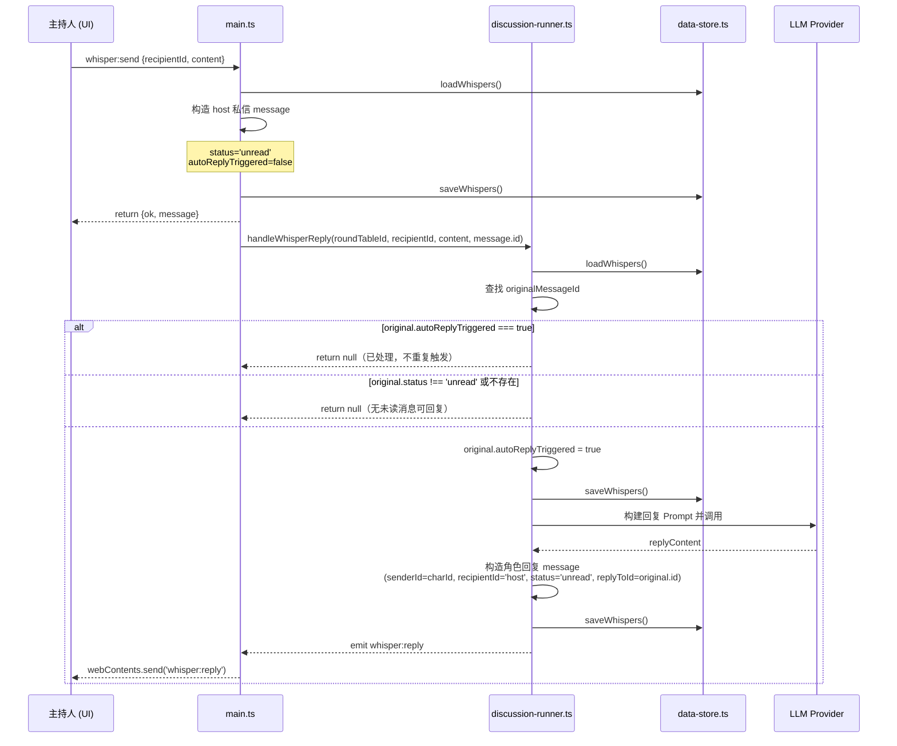
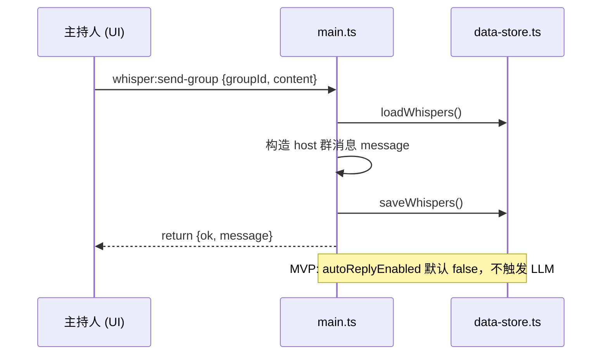
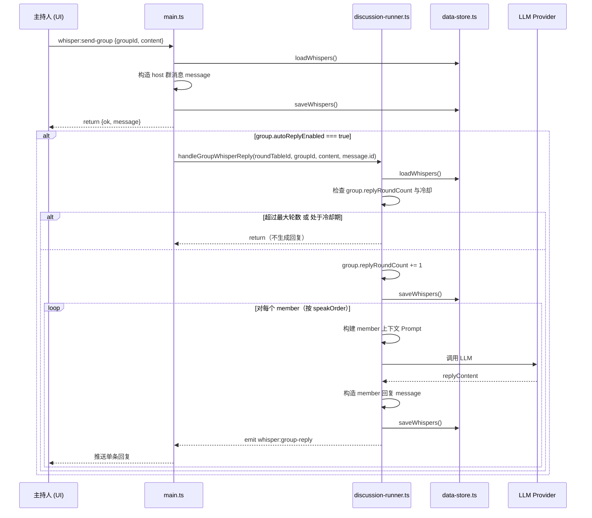
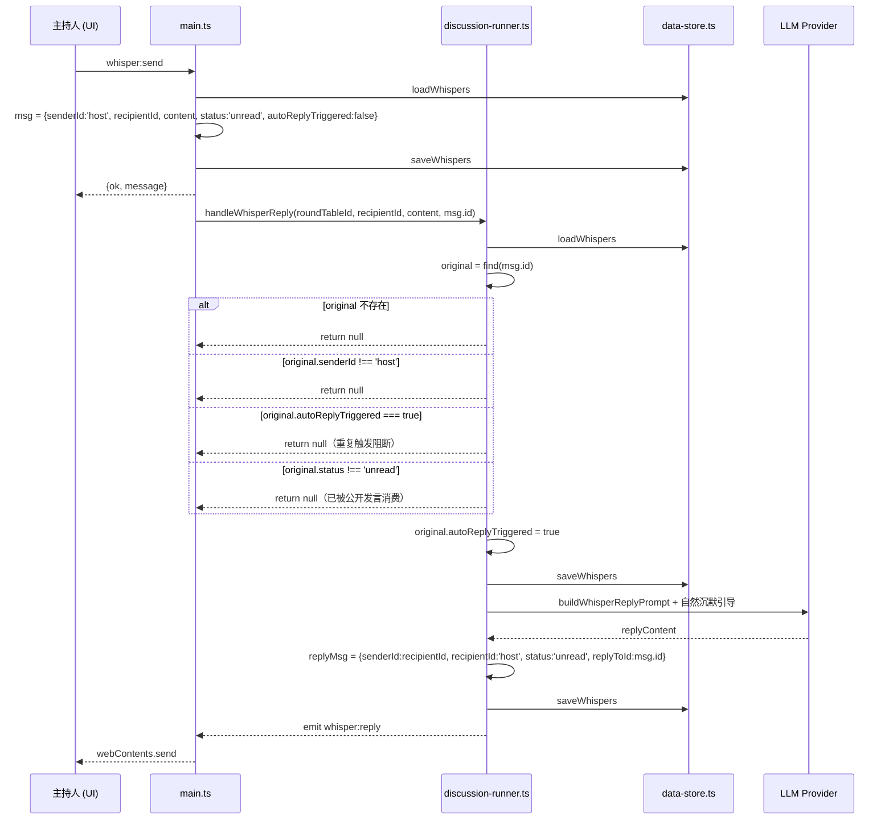

# Whisper System 防无限对话机制设计

> **版本**: v0.1  
> **作者**: Bob（Architect）  
> **日期**: 2025-07-18  
> **性质**: ARCH-whisper-system.md 增量章节（第 9 章）

---

## 1. 方案名称

**WAIL-Guard**（Whisper Anti-Infinite-Loop Guard）

一句话概括：以「主持人唯一触发源 + 单轮单次回复 + 角色不主动私聊」的确定性规则为底座，逐步叠加概率、冷却、手动触发等柔性控制。

---

## 2. 设计目标

1. 避免 1:1 私信中 AI 角色与主持人/其他角色形成双向或多轮自动回复循环。
2. 避免群聊中多个角色互相触发链式回复，导致消息风暴。
3. 保留主持人对 Whisper 交互节奏的绝对控制权。
4. 让 AI 在不需要回复时能够自然选择沉默，而不是靠硬编码拒绝。
5. 实现上先落地最小可行集（MVP），再按需叠加增强项。

---

## 3. 核心规则（MVP 确定集）

### 3.1 1:1 私信规则

| 规则编号 | 规则内容 | 目的 |
|---------|---------|------|
| R1-1 | **主持人是唯一触发源** | 只有主持人发送的私信才会触发 AI 回复。 |
| R1-2 | **单条主持人消息只触发一次 AI 回复** | `handleWhisperReply` 执行后，对应 originalMessageId 即视为已处理，禁止再次触发。 |
| R1-3 | **角色不得主动发送私信** | 任何 AI 角色不能在没有主持人消息的情况下主动发起 1:1 私信。 |
| R1-4 | **AI 回复不继续触发下一轮** | `handleWhisperReply` 生成的角色回复 `status = 'unread'`，但系统不会基于这条回复再次调用 LLM。 |
| R1-5 | **公开发言中的私信上下文只消费一次** | `injectWhisperContext` 找出的待处理私信，在角色完成一次公开发言后标记为 `read`，避免重复注入。 |

### 3.2 群聊规则

| 规则编号 | 规则内容 | 目的 |
|---------|---------|------|
| R2-1 | **群主（主持人）是唯一发言触发源** | 群聊中任何 AI 回复必须由主持人的一条群消息触发。 |
| R2-2 | **单条群消息最多触发一轮群内回复** | 无论群内有多少成员，一次主持人群消息最多触发一轮、每个成员最多一次回复。 |
| R2-3 | **群内角色之间禁止互相 @/回复触发** | AI 成员回复群主后，其他成员不得以该回复为由继续自动回复。 |
| R2-4 | **默认关闭群聊 AI 自动回复** | MVP 阶段 `autoReplyEnabled` 对群聊默认为 `false`，仅保存群主消息，不自动调用 LLM。 |

---

## 4. 状态 / 字段变更

### 4.1 新增字段（MVP）

 WhisperMessage 扩展：

```typescript
export interface WhisperMessage {
  // ... 原有字段 ...

  /**
   * 是否已经触发过自动回复。
   * 仅对 senderId='host' 的 1:1 私信有意义。
   * handleWhisperReply 首次调用前为 false，调用成功后置为 true。
   * 用于防止重复触发、意外重试导致的多轮循环。
   */
  autoReplyTriggered?: boolean;
}
```

 WhisperGroup 扩展：

```typescript
export interface WhisperGroup {
  // ... 原有字段 ...

  /**
   * 是否允许该群聊触发 AI 自动回复。
   * MVP 默认 false；后续可开放给主持人开关。
   */
  autoReplyEnabled?: boolean;

  /**
   * 该群聊自创建以来已完成的「主持人消息 → AI 回复」轮数。
   * 用于限制总轮数和审计。
   */
  replyRoundCount?: number;
}
```

### 4.2 可选增强字段（P1+）

| 字段 | 所属类型 | 说明 |
|------|---------|------|
| `lastWhisperReplyAt` | `Character` / 内联 `InlineCharacter` | 角色最近一次产生私信回复的时间戳，用于冷却判定。 |
| `whisperReplyCooldownMs` | `RuleSet` / 配置 | 全局冷却时间，默认 0（MVP），可选 5000–30000 ms。 |
| `replyProbability` | `WhisperGroup` / `Character` | 0.0–1.0，控制角色选择回复还是沉默的概率。 |
| `mustReply` | `WhisperMessage` | 主持人可手动标记某条消息「必须回复」，覆盖概率/冷却。 |
| `manualTriggerOnly` | `WhisperGroup` | 群聊是否仅由主持人手动按钮触发下一轮回复。 |

---

## 5. 1:1 私信防循环流程

### 5.1 正常流程



### 5.2 关键约束点

1. **重复触发防护**：`handleWhisperReply` 入口处检查 `original.autoReplyTriggered`，为 `true` 直接返回。
2. **状态一致性**：只有 `status === 'unread'` 的主持人私信才允许触发回复；若已被公开发言消费为 `read`，也不再触发私信回复（二者互斥）。
3. **不递归**：角色回复消息自身不带 `autoReplyTriggered` 字段，也不会被系统扫描为触发源。

---

## 6. 群聊防消息风暴流程

### 6.1 MVP 默认行为



### 6.2 开启自动回复后的受控流程（P1）



### 6.3 群聊循环阻断规则

| 阻断点 | 实现方式 |
|--------|---------|
| 单轮上限 | 一条主持人群消息只触发 `handleGroupWhisperReply` 一次。 |
| 成员间不触发 | AI 成员回复保存为普通 `WhisperMessage`，不设置 `autoReplyTriggered` 触发源标记。 |
| 总轮数上限 | `group.replyRoundCount` 达到阈值（如 10）后拒绝再触发。 |
| 冷却期 | 可选 `lastGroupReplyAt` + `cooldownMs` 判定。 |
| 手动触发 | 开启 `manualTriggerOnly` 后，自动流程跳过，等待主持人点击「继续下一轮」。 |

---

## 7. Prompt 层面引导自然沉默

### 7.1 1:1 私信回复 Prompt 末尾追加

```text
你可以直接回复主持人，也可以简单表示已读、点头、或暂时没有更多要说的。
如果这条私信不需要立即行动，保持简短即可，不必刻意展开对话。
```

### 7.2 群聊回复 Prompt 末尾追加

```text
这是群主发送给群里的消息。请判断是否需要回应：
- 如果消息与你无关、或你没有什么要补充的，可以直接说“我没什么好说的”或保持沉默。
- 不要为了让对话继续而强行发言。
- 不要直接回复其他 AI 成员的发言，只回应群主这条消息。
```

### 7.3 公开发言 Prompt 中的私信上下文

保持原有设计，但明确：

```text
你收到的主持人私信（私密，仅你和主持人可见，不得泄露）：
...

请在公开发言中自然地回应上述私信，但：
- 如果私信内容不需要在本次发言中体现，你可以完全不提；
- 不要编造新的私信或暗示其他角色也收到了类似信息。
```

---

## 8. 主持人控制能力

### 8.1 MVP 已支持

- **暂停态才能发送私信**：`WhisperPanel` 的 `isPaused` 控制输入框可用性，天然限制主持人只能在明确断点发送私信。
- **群聊默认不自动回复**：`autoReplyEnabled` 默认 `false`。

### 8.2 P1 增强

| 控制能力 | 位置 | 说明 |
|---------|------|------|
| 开关某角色 1:1 自动回复 | `OneOnOneTab` 联系人列表每项增加 toggle | 对应 `Character` 或 `WhisperMessage` 级标记。 |
| 开关某群聊自动回复 | `GroupTab` 群设置面板 | 对应 `WhisperGroup.autoReplyEnabled`。 |
| 手动触发下一轮群聊回复 | `GroupTab` 输入区上方增加「继续」按钮 | 仅当 `manualTriggerOnly=true` 或冷却中显示。 |
| 标记消息必须回复 | 长按/右键主持人消息 | 设置 `mustReply=true`，覆盖概率与冷却。 |
| 全局冷却配置 | 设置页 | `whisperReplyCooldownMs` 等参数。 |

---

## 9. 涉及文件路径

### 9.1 后端

| 文件 | 改动 |
|------|------|
| `electron/main.ts` | `whisper:send` 保存 host 私信时设置 `autoReplyTriggered=false`；`whisper:send-group` 保存群消息并检查 `autoReplyEnabled`。 |
| `electron/discussion-runner.ts` | `handleWhisperReply` 增加重复触发检查、状态互斥检查；新增 `handleGroupWhisperReply`（P1）。 |
| `electron/data-store.ts` | 无需新增函数，但 `loadWhispers`/`saveWhispers` 需要正确读写新增字段。 |

### 9.2 类型

| 文件 | 改动 |
|------|------|
| `src/lib/types.ts` | `WhisperMessage` 增加 `autoReplyTriggered?`；`WhisperGroup` 增加 `autoReplyEnabled?`、`replyRoundCount?`。 |
| `electron/types.ts` | 同步内联类型（如果与 src/lib/types.ts 分离）。 |

### 9.3 前端

| 文件 | 改动 |
|------|------|
| `src/hooks/useWhisper.ts` | 监听 `whisper:reply` / `whisper:group-reply` 时去重；提供按群/按角色的控制 API。 |
| `src/components/WhisperPanel.tsx` | 根据 `isPaused` 与开关状态禁用输入区；显示冷却/轮数提示。 |
| `src/components/OneOnOneTab.tsx` | 增加角色级自动回复开关（P1）。 |
| `src/components/GroupTab.tsx` | 增加群聊自动回复开关、手动触发按钮、轮数显示（P1）。 |

---

## 10. MVP + 可选增强实现顺序

### Phase 1 — MVP（P0，立即落地）

1. **类型更新**：在 `WhisperMessage` 增加 `autoReplyTriggered?: boolean`；在 `WhisperGroup` 增加 `autoReplyEnabled?: boolean`（默认 `false`）与 `replyRoundCount?: number`（默认 `0`）。
2. **`electron/main.ts` 修改**：
   - `whisper:send` 构造 host 私信时设置 `autoReplyTriggered = false`。
   - `whisper:send-group` 构造 host 群消息后，若 `group.autoReplyEnabled` 为 `false` 直接返回，不触发 LLM。
3. **`electron/discussion-runner.ts` 修改**：
   - `handleWhisperReply` 入口增加防御：
     - `original` 不存在 → return null。
     - `original.senderId !== 'host'` → return null。
     - `original.status !== 'unread'` → return null（已被公开发言消费）。
     - `original.autoReplyTriggered === true` → return null（已触发过）。
   - 确认可触发后，先设置 `original.autoReplyTriggered = true` 并 `saveWhispers`，再调用 LLM。
   - 生成的角色回复消息不再具备触发下一轮的条件。
4. **前端去重**：`useWhisper` 的 `onWhisperReply` / `onWhisperGroupReply` 回调中按 `reply.id` 去重，防止 IPC 重复推送导致 UI 重复。
5. **Prompt 更新**：在私信回复 Prompt 与群聊回复 Prompt 末尾追加「自然沉默」引导语。

### Phase 2 — 增强控制（P1）

1. **角色级 1:1 开关**：`Character` 增加 `whisperAutoReplyEnabled?: boolean`（默认 `true`），`OneOnOneTab` 提供 toggle。
2. **群聊自动回复开关**：`GroupTab` 提供 toggle 修改 `WhisperGroup.autoReplyEnabled`。
3. **冷却时间**：
   - 后端维护 `lastWhisperReplyAt`（每个角色）与 `lastGroupReplyAt`（每个群）。
   - 配置项 `whisperReplyCooldownMs` / `groupReplyCooldownMs`。
   - 触发前检查时间差。
4. **回复概率**：在冷却通过后，按角色/群配置的概率决定是否调用 LLM；未命中时直接视为「沉默」，可推送一条 `whisper:reply` 占位消息（`content='（沉默）'`）或完全不推送。
5. **手动触发**：`manualTriggerOnly` 模式下，`whisper:send-group` 只保存群主消息，不自动触发；主持人点击「继续」按钮调用新 IPC `whisper:trigger-group-reply` 执行 `handleGroupWhisperReply`。
6. **必须回复标记**：`mustReply=true` 的消息绕过概率和冷却检查。
7. **审计与日志**：在控制台输出 WAIL-Guard 阻断原因（duplicate/cooldown/probability/limit），便于 QA 验证。

---

## 11. 时序图：MVP 1:1 完整流程（含 WAIL-Guard 检查）



---

## 12. 验证要点（供 QA 使用）

| 编号 | 场景 | 期望结果 |
|------|------|---------|
| V1 | 主持人连续快速发送 3 条私信给同一角色 | 每条私信触发一次回复，共 3 次；不会因为网络延迟导致某条触发 2 次。 |
| V2 | 重启应用后，已触发过回复的私信再次收到 `whisper:send` 内部重试 | `autoReplyTriggered=true` 阻止重复调用 LLM。 |
| V3 | 某条私信被角色在公开发言中自然回应后 | `status` 变为 `read`，不再触发私信回复。 |
| V4 | 角色回复到达后 | 系统不会基于该回复再次调用 `handleWhisperReply`。 |
| V5 | 群聊 `autoReplyEnabled=false` | 主持人发送群消息后，群内无 AI 自动回复。 |
| V6 | 开启群聊自动回复并发送消息 | 每个成员最多回复一次，成员之间不互相触发。 |
| V7 | 群聊 `replyRoundCount` 达到上限 | 后续主持人消息不再触发群聊 AI 回复。 |

---

## 13. 与现有缺陷修复的关系

本防循环机制依赖此前已识别的三项核心修复：

1. `electron/main.ts` 的 `whisper:send` handler 在保存 host 私信后正确调用 `handleWhisperReply(roundTableId, recipientId, content, message.id)`。
2. `electron/discussion-runner.ts` 的 `injectWhisperContext` 保持纯函数，返回 `{ text, readIds }`；由 `startDiscussion` / `appendRound` 的调用方在 LLM 生成成功后标记 `read` 并 `saveWhispers`。
3. `handleWhisperReply` 签名统一为 `(roundTableId, recipientId, whisperContent, originalMessageId)`，便于主进程直接调用且兼容 InlineRoundTable。

WAIL-Guard 在此基础上新增 `autoReplyTriggered` 等字段与流程检查，确保自动回复不会自我循环。
